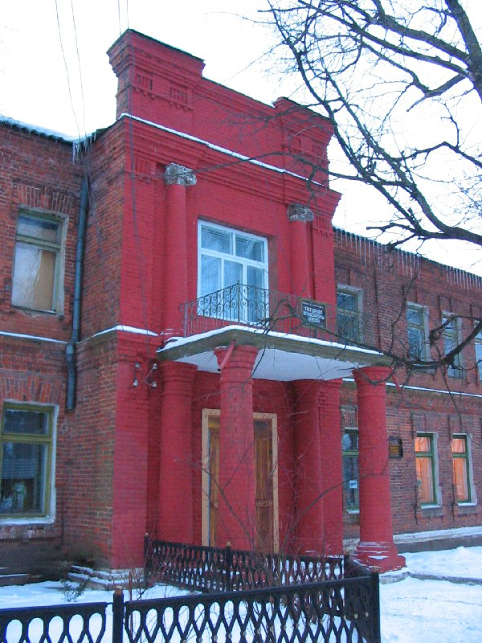
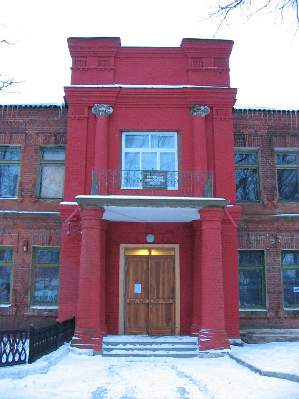
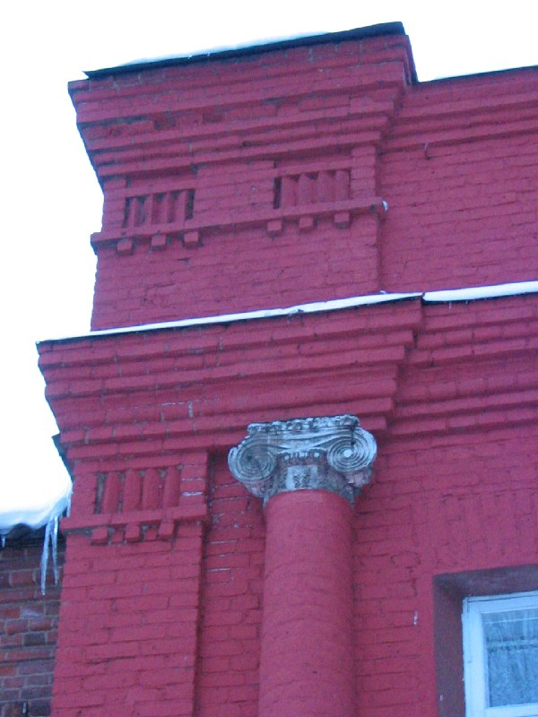
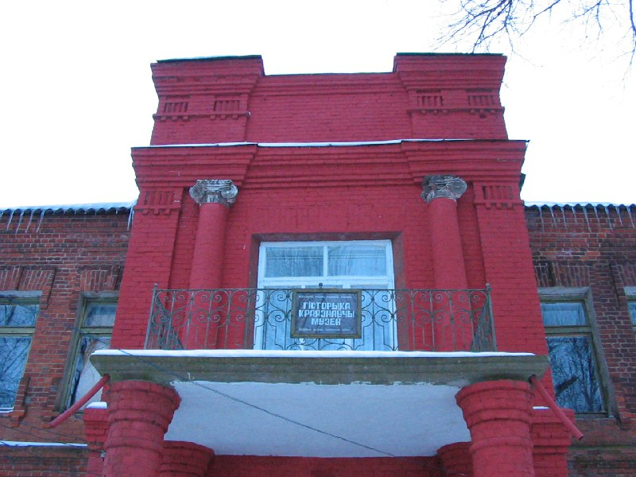
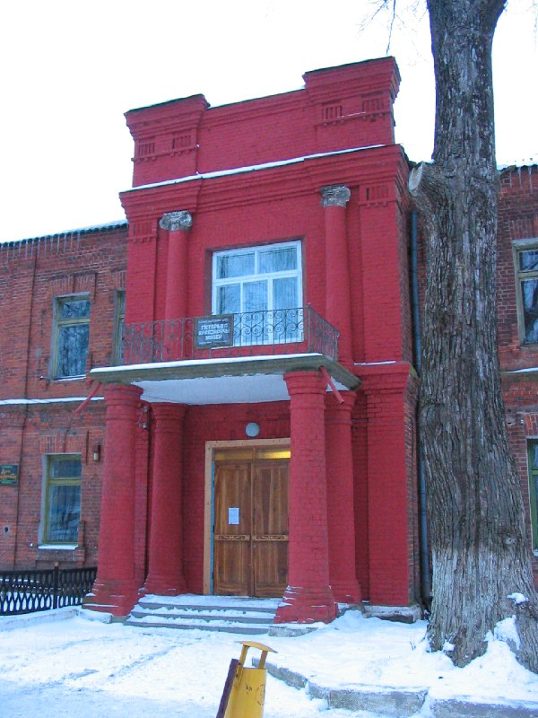
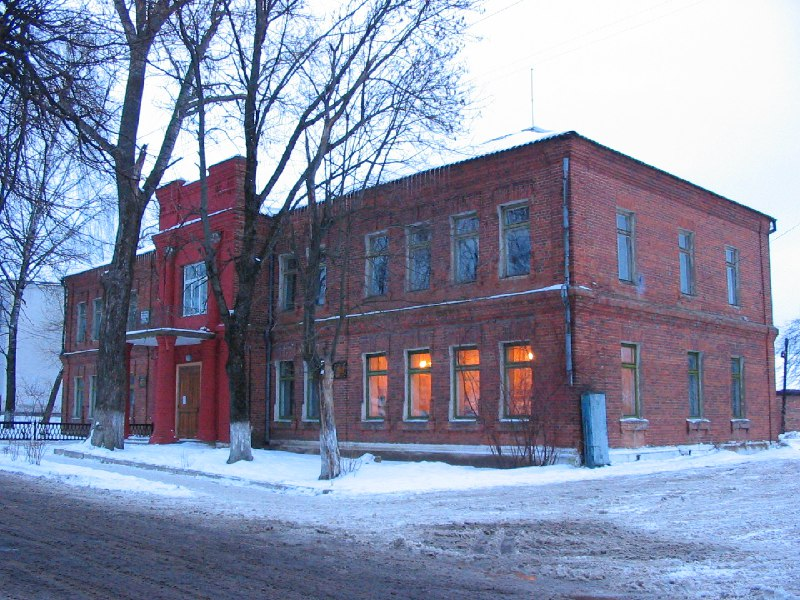

+++
title = ""
date = 2026-01-30T11:19:41+00:00
description = "belarus architecture museum red сенно From"

[taxonomies]
days = ["2026-01-30"]
tags = ["belarus", "architecture", "museum", "red", "сенно"]

[extra]
id = 1059
day = "2026-01-30"
tg_url = "https://t.me/vitaly_zdanevich_chan/1059"
og_image = "01.jpg"
next_id = 1065
next_title = ""
prev_id = 1058
prev_title = ""
views = 7
ids = [1059]
+++

{{ tag(t="belarus") }}
{{ tag(t="architecture") }}
{{ tag(t="museum") }}
{{ tag(t="red") }}
{{ tag(t="сенно") }}

From [https://commons.wikimedia.org/wiki/File:045-425\_Сенно,\_снято\_12\_февраля\_2005.jpg](https://commons.wikimedia.org/wiki/File:045-425_%D0%A1%D0%B5%D0%BD%D0%BD%D0%BE,_%D1%81%D0%BD%D1%8F%D1%82%D0%BE_12_%D1%84%D0%B5%D0%B2%D1%80%D0%B0%D0%BB%D1%8F_2005.jpg)

