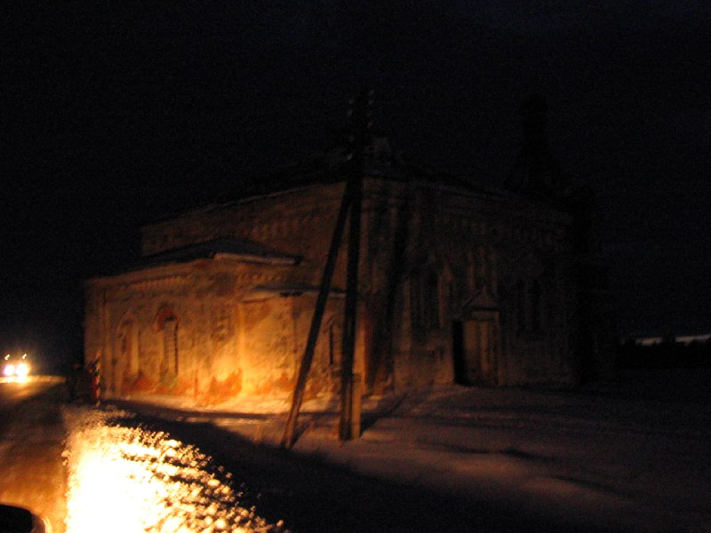
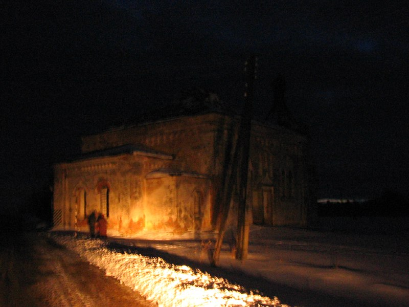
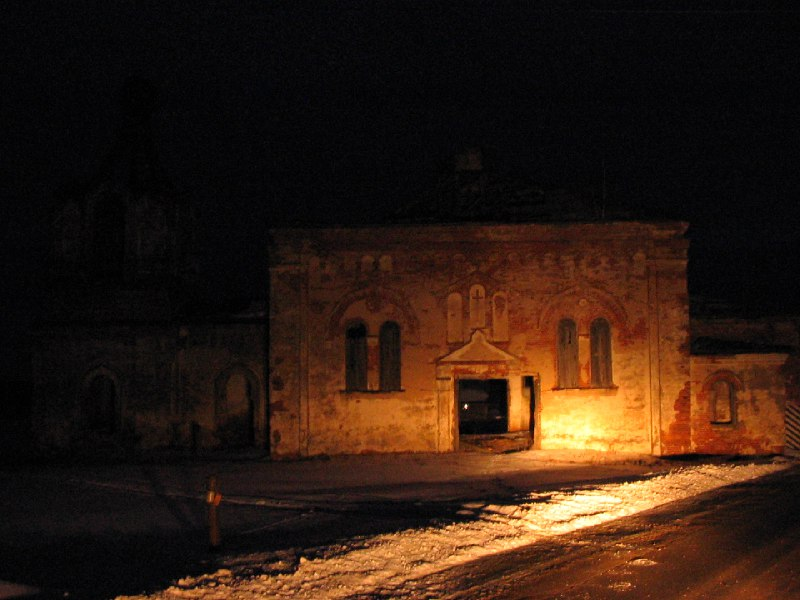
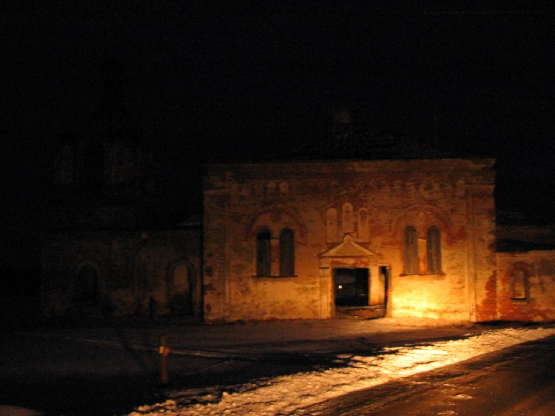

+++
title = ""
date = 2026-01-30T11:21:29+00:00
description = "belarus architecture church night distortion year2005 globustut From"

[taxonomies]
days = ["2026-01-30"]
tags = ["belarus", "architecture", "church", "night", "distortion", "year_2005", "globustut"]

[extra]
id = 1065
day = "2026-01-30"
tg_url = "https://t.me/vitaly_zdanevich_chan/1065"
og_image = "01.jpg"
next_id = 1069
next_title = ""
prev_id = 1059
prev_title = ""
views = 11
ids = [1065]
+++

{{ tag(t="belarus") }}  
{{ tag(t="architecture") }}  
{{ tag(t="church") }}  
{{ tag(t="night") }}  
{{ tag(t="distortion") }}  
{{ tag(t="year_2005") }}  
{{ tag(t="globustut") }}  

From [https://commons.wikimedia.org/wiki/File:045-464\_Монастырь,\_снято\_12\_февраля\_2005.jpg](https://commons.wikimedia.org/wiki/File:045-464_%D0%9C%D0%BE%D0%BD%D0%B0%D1%81%D1%82%D1%8B%D1%80%D1%8C,_%D1%81%D0%BD%D1%8F%D1%82%D0%BE_12_%D1%84%D0%B5%D0%B2%D1%80%D0%B0%D0%BB%D1%8F_2005.jpg)

