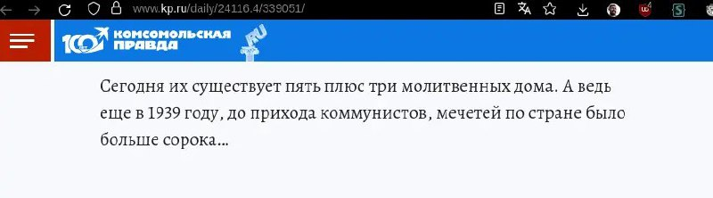

+++
title = ""
date = 2026-02-03T09:53:54+00:00
description = "ussr history Сегодня их существует пять плюс три молитвенных дома. А ведь еще в 1939 году, до прихода коммунистов, мечетей по стране было больше сорока"

[taxonomies]
days = ["2026-02-03"]
tags = ["ussr", "history"]

[extra]
id = 1080
day = "2026-02-03"
tg_url = "https://t.me/vitaly_zdanevich_chan/1080"
og_image = "5190706876641906521_1208555623_460001113.jpg"
next_id = 1081
next_title = ""
prev_id = 1079
prev_title = ""
views = 13
ids = [1080]
+++

{{ tag(t="ussr") }}
{{ tag(t="history") }}

> Сегодня их существует пять плюс три молитвенных дома. А ведь еще в 1939 году, до прихода коммунистов, мечетей по стране было больше сорока

<https://www.kp.ru/daily/24116.4/339051/>

