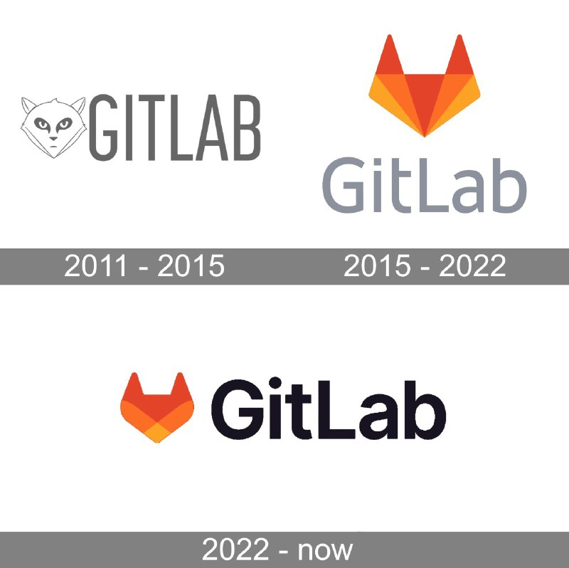

+++
title = "logo gitlab git"
date = 2026-02-05T04:41:28+00:00
description = "logo gitlab git"

[taxonomies]
tags = ["logo", "gitlab", "git"]

[extra]
tg_url = "https://t.me/vitaly_zdanevich_chan/1085"
og_image = "01.jpg"
next_id = 1087
next_title = "fashion boy"
prev_id = 1084
prev_title = "logo foobar audio_player"
views = 8
ids = [1085]
+++

{{ tag(t="logo") }}
{{ tag(t="gitlab") }}
{{ tag(t="git") }}

[https://gitlab.com](https://gitlab.com/)

