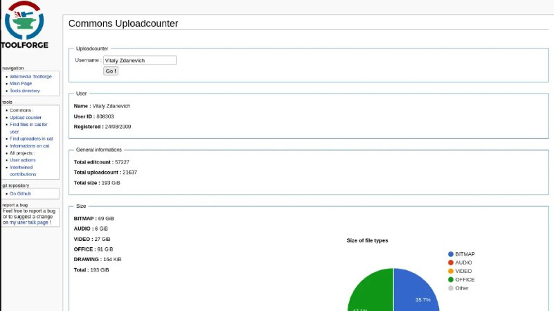

+++
title = ""
date = 2026-02-05T15:00:55+00:00
description = "commons My account is big, my account is very big"

[taxonomies]
days = ["2026-02-05"]
tags = ["commons"]

[extra]
id = 1093
day = "2026-02-05"
tg_url = "https://t.me/vitaly_zdanevich_chan/1093"
og_image = "5199841215518543711_1210682377_460001119.jpg"
next_id = 1094
next_title = ""
next_body = "#firefox translation from #german to #russian"
prev_id = 1092
prev_title = ""
prev_body = "#recording my screen (like previous message) with #ffmpeg:\nffmpeg -vaapidevice /dev/dri/renderD128\n-f x11grab -videosize 1366x768\n-i :0\n-vf setpts=N/FR/TB\n-c:v h264vaapi -vf 'format=nv12,hwupload'\n/record/out/$(date +%Y-%b-%d%a--%H-%M-%S | tr A-Z a-z).mp4\n#\n#\n# setpts=N/FR/TB\n# to be able to pause by Ctrl-Z, see"
views = 15
ids = [1093]
+++

{{ tag(t="commons") }}  

My account is big, my account is very big  

<https://ptools.toolforge.org/uploadsum.php?user=Vitaly+Zdanevich>

