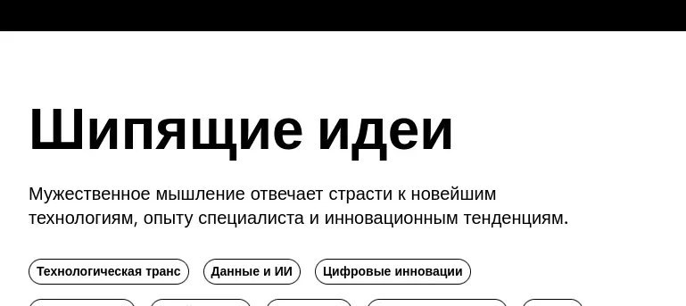

+++
title = ""
date = 2026-02-05T15:18:36+00:00
description = "firefox translation from german to russian"

[taxonomies]
days = ["2026-02-05"]
tags = ["firefox", "german", "russian"]

[extra]
id = 1094
day = "2026-02-05"
tg_url = "https://t.me/vitaly_zdanevich_chan/1094"
og_image = "5199841215518543774_1210682377_460001182.jpg"
next_id = 1095
next_title = ""
next_body = "#ai ai ai ai ai but looks like even text translation with not very big languages is so bad :(\nChecked in #firefox and #googletranslate"
prev_id = 1093
prev_title = ""
prev_body = "#commons\nMy account is big, my account is very big"
views = 15
ids = [1094]
+++

{{ tag(t="firefox") }} translation from {{ tag(t="german") }} to {{ tag(t="russian") }}

