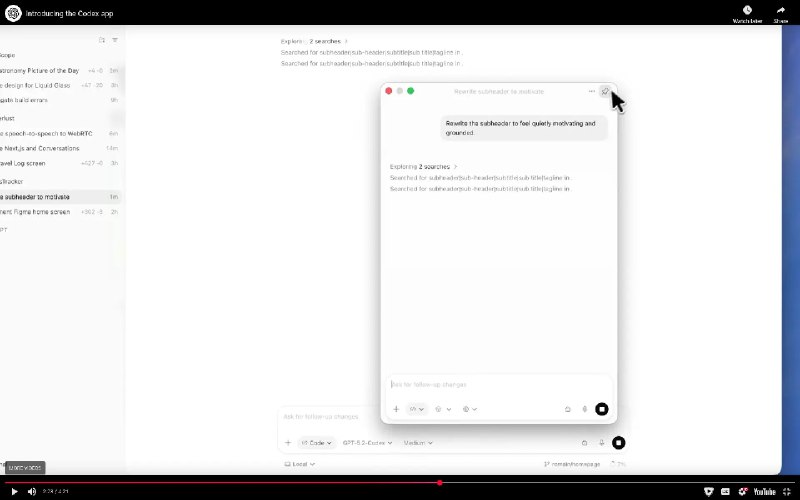

+++
title = ""
date = 2026-02-05T21:10:47+00:00
description = "I love display aspect ratio 16x10 because I have the special space for youtube ui, when most videos are 16x9"

[taxonomies]
days = ["2026-02-05"]
tags = ["display", "youtube", "ui"]

[extra]
id = 1097
day = "2026-02-05"
tg_url = "https://t.me/vitaly_zdanevich_chan/1097"
og_image = "5199841215518544654_1210682377_460002062.jpg"
next_id = 1098
next_title = ""
next_body = ""
prev_id = 1095
prev_title = ""
prev_body = "#ai ai ai ai ai but looks like even text translation with not very big languages is so bad :(\nChecked in #firefox and #googletranslate"
views = 17
ids = [1097]
+++

I love {{ tag(t="display") }} aspect ratio 16x10 because I have the special space for {{ tag(t="youtube") }} {{ tag(t="ui") }}, when most videos are 16x9

