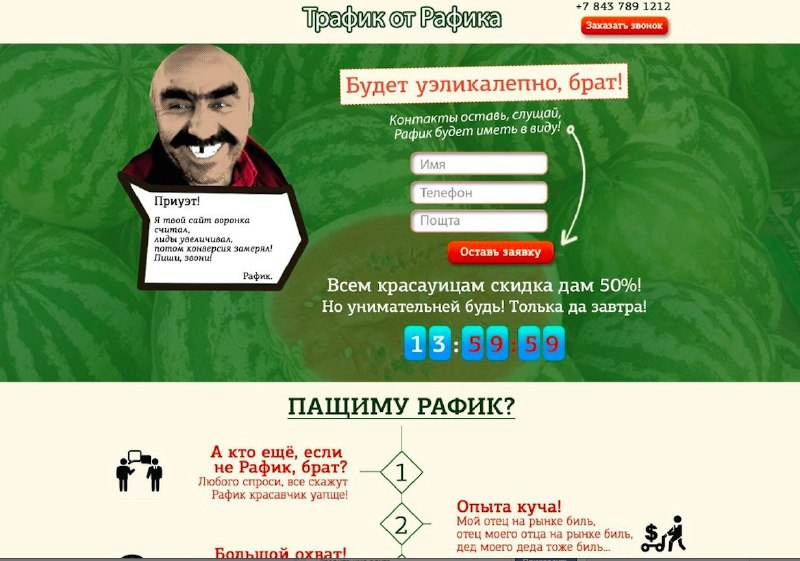

+++
title = ""
date = 2026-02-05T23:41:35+00:00

[taxonomies]
days = ["2026-02-05"]

[extra]
id = 1098
day = "2026-02-05"
tg_url = "https://t.me/vitaly_zdanevich_chan/1098"
og_image = "5199841215518544769_1210682377_460002177.jpg"
next_id = 1099
next_title = ""
next_body = "#love it - against #youtube #clickbait"
prev_id = 1097
prev_title = ""
prev_body = "I love #display aspect ratio 16x10 because I have the special space for #youtube #ui, when most videos are 16x9"
views = 19
ids = [1098]
+++

