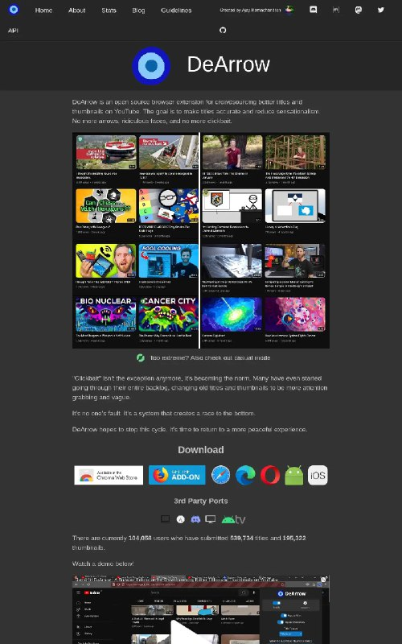

+++
title = ""
date = 2026-02-07T13:08:08+00:00
description = "love it - against youtube clickbait"

[taxonomies]
days = ["2026-02-07"]
tags = ["love", "youtube", "clickbait"]

[extra]
id = 1099
day = "2026-02-07"
tg_url = "https://t.me/vitaly_zdanevich_chan/1099"
og_image = "5204095548128956047_1211672916_460000911.jpg"
next_id = 1100
next_title = ""
next_body = "#ai\nTrying #codex to organize scans - to create a folder for every newspaper issue, result is not very good - mistakes and slow"
prev_id = 1098
prev_title = ""
prev_body = ""
views = 16
ids = [1099]
+++

{{ tag(t="love") }} it - against {{ tag(t="youtube") }} {{ tag(t="clickbait") }} <https://dearrow.ajay.app/>

