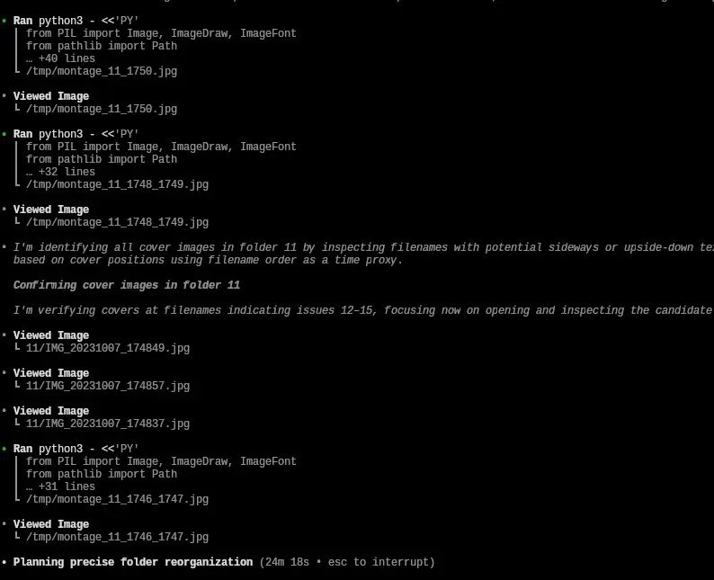
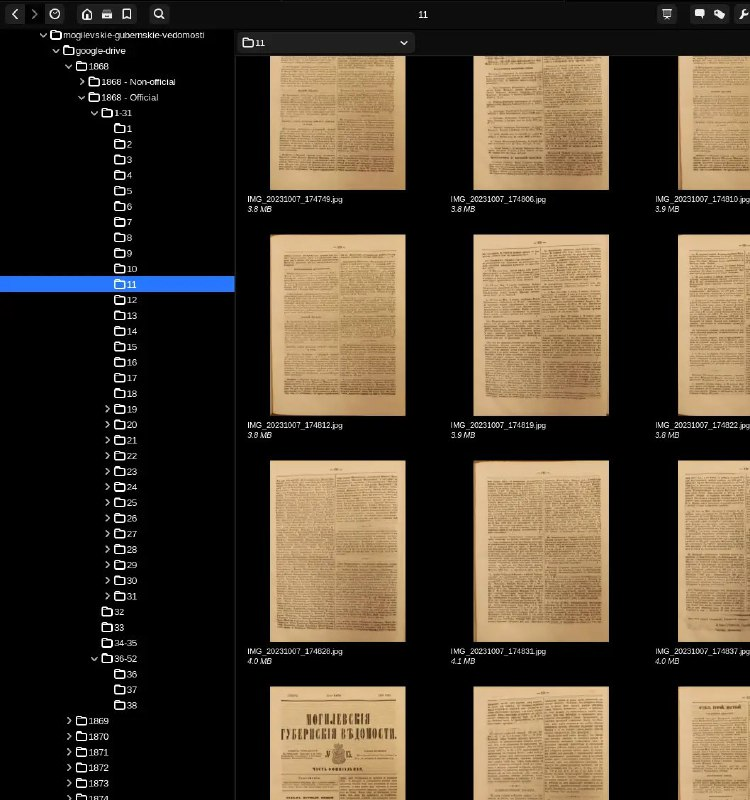

+++
title = ""
date = 2026-02-08T08:37:33+00:00
description = "ai Trying codex to organize scans - to create a folder for every newspaper issue, result is not very good - mistakes and slow"

[taxonomies]
days = ["2026-02-08"]
tags = ["ai", "codex"]

[extra]
id = 1100
day = "2026-02-08"
tg_url = "https://t.me/vitaly_zdanevich_chan/1100"
og_image = "01.jpg"
next_id = 1102
next_title = ""
prev_id = 1099
prev_title = ""
views = 18
ids = [1100]
+++

{{ tag(t="ai") }}  

Trying {{ tag(t="codex") }} to organize scans - to create a folder for every newspaper issue, result is not very good - mistakes and slow

