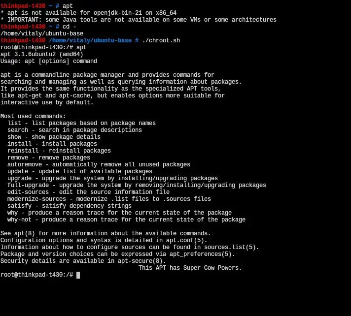

+++
title = "How to make ubuntu folder for chroot"
date = 2026-02-09T09:29:30+00:00
description = "How to make ubuntu folder for chroot wget Only 34 MB wget sha256sum -c SHA256SUMS 2/dev/null mkdir ubuntu-base tar -xzf ubuntu-base-25.10-base-amd64.tar.gz -C ubuntu-base cd ubuntu-base/ cp…"

[taxonomies]
tags = ["ubuntu", "chroot"]

[extra]
tg_url = "https://t.me/vitaly_zdanevich_chan/1102"
og_image = "5208565307709003033_1212713613_460002585.jpg"
next_id = 1103
next_title = "My new bash alias: one function to go to the next folder (like from 2025 to 2026, from aaa to bbb) and the second one to cd to prev"
prev_id = 1100
prev_title = "Trying codex to organize scans - to create a folder for every newspaper issue, result is not very good - mistakes and slow"
views = 18
ids = [1102]
+++

**How to make** {{ tag(t="ubuntu") }} **folder for** {{ tag(t="chroot") }}

<https://en.wikipedia.org/wiki/Chroot>

```
wget https://cdimage.ubuntu.com/ubuntu-base/releases/25.10/release/ubuntu-base-25.10-base-amd64.tar.gz
# Only 34 MB

wget https://cdimage.ubuntu.com/ubuntu-base/releases/25.10/release/SHA256SUMS

sha256sum -c SHA256SUMS 2>/dev/null

mkdir ubuntu-base

tar -xzf ubuntu-base-25.10-base-amd64.tar.gz -C ubuntu-base

cd ubuntu-base/

cp /etc/resolv.conf etc/resolv.conf
```

Create file inside:

```
mount --bind /dev  dev
mount --bind /proc proc
mount --bind /sys  sys
mount --bind /run  run
chroot . /bin/bash
```

and run from root (because requires [CAP\_SYS\_CHROOT](https://man7.org/linux/man-pages/man7/capabilities.7.html))


