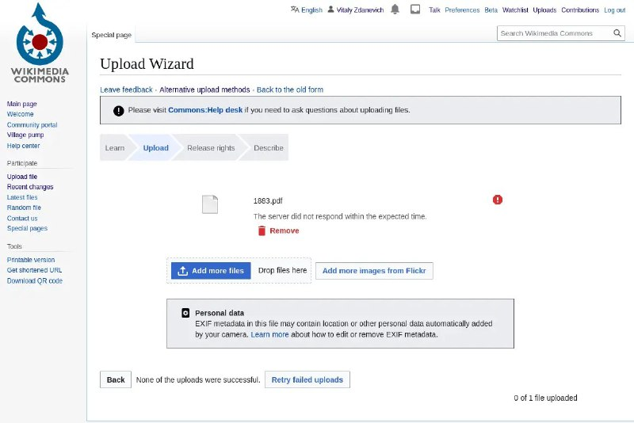

+++
title = ""
date = 2026-02-11T09:32:02+00:00
description = "commons The server did not respond within the expected time If you cannot upload your big pdf - you can extract all images from it, with original quality: import fitz PyMuPDF doc =…"

[taxonomies]
days = ["2026-02-11"]
tags = ["commons", "pdf", "pywikibot"]

[extra]
id = 1105
day = "2026-02-11"
tg_url = "https://t.me/vitaly_zdanevich_chan/1105"
og_image = "5215513357908120858_1214331332_460002586.jpg"
next_id = 1106
next_title = ""
prev_id = 1104
prev_title = ""
views = 19
ids = [1105]
+++

{{ tag(t="commons") }}

> The server did not respond within the expected time

If you cannot upload your big {{ tag(t="pdf") }} - you can extract all images from it, with original quality:

```
import fitz  # PyMuPDF

doc = fitz.open('your_file.pdf')
for page_index in range(len(doc)):
    for img_index, img in enumerate(doc.get_page_images(page_index)):
        xref = img[0]
        base_image = doc.extract_image(xref)
        image_bytes = base_image['image']
        image_ext = base_image['ext']  # Preserve original format (e.g., 'jpeg', 'png', 'jp2')
        with open(f'page{page_index+1}_{img_index+1}.{image_ext}', 'wb') as f:
            f.write(image_bytes)
```

and upload through my {{ tag(t="pywikibot") }} wrapper <https://gitlab.com/vitaly-zdanevich/pwb_wrapper_for_simpler_uploading_to_commons>


