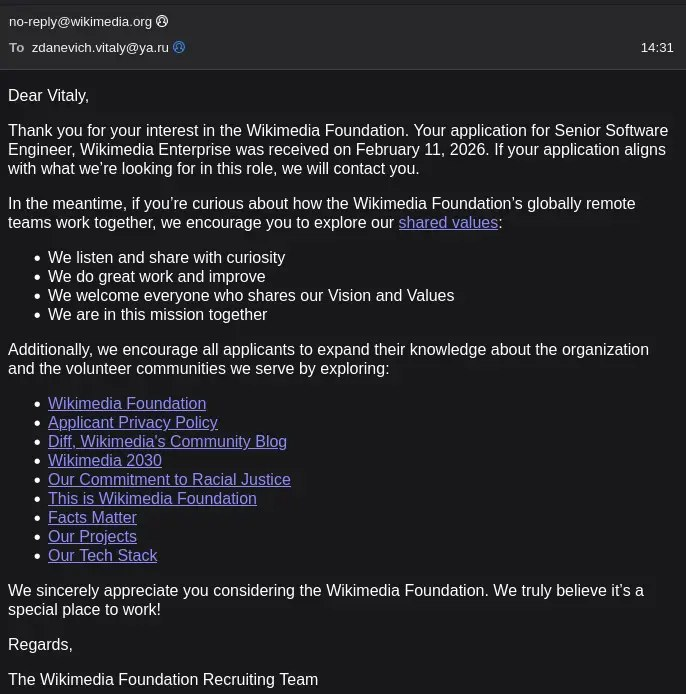

+++
title = ""
date = 2026-02-11T10:47:08+00:00
description = "wikipedia job"

[taxonomies]
days = ["2026-02-11"]
tags = ["wikipedia", "job"]

[extra]
id = 1106
day = "2026-02-11"
tg_url = "https://t.me/vitaly_zdanevich_chan/1106"
og_image = "5215513357908121079_1214331332_460002807.jpg"
next_id = 1107
next_title = ""
prev_id = 1105
prev_title = ""
views = 19
ids = [1106]
+++

{{ tag(t="wikipedia") }}  
{{ tag(t="job") }}

