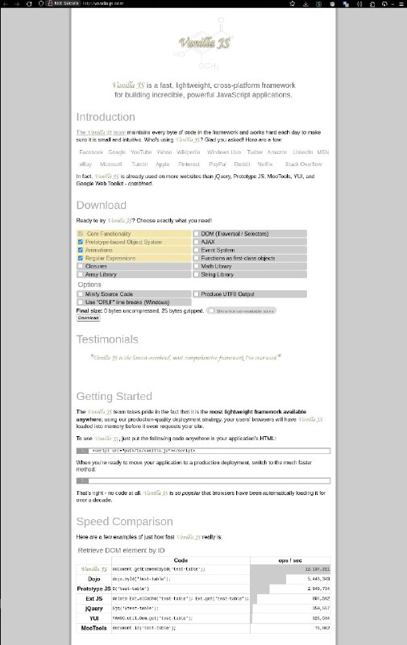

+++
title = ""
date = 2026-02-13T13:58:32+00:00
description = "js I downloaded it - really 0 bytes."

[taxonomies]
days = ["2026-02-13"]
tags = ["js"]

[extra]
id = 1111
day = "2026-02-13"
tg_url = "https://t.me/vitaly_zdanevich_chan/1111"
og_image = "5224374876167148716_1216394565_460002476.jpg"
next_id = 1112
next_title = ""
prev_id = 1110
prev_title = ""
views = 17
ids = [1111]
+++

{{ tag(t="js") }}  

I downloaded it - really 0 bytes.  

<http://vanilla-js.com/>

