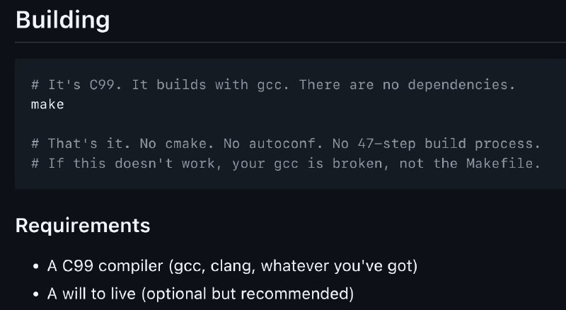

+++
title = "gcc make"
date = 2026-02-18T20:47:40+00:00
description = "gcc make"

[taxonomies]
tags = ["gcc", "make"]

[extra]
tg_url = "https://t.me/vitaly_zdanevich_chan/1117"
og_image = "5238215232184848897_1219617024_460001793.jpg"
next_id = 1118
next_title = "My geeknote (evernote cli) now available on PyPI"
prev_id = 1116
prev_title = "The old one"
views = 12
ids = [1117]
+++

{{ tag(t="gcc") }}
{{ tag(t="make") }}

