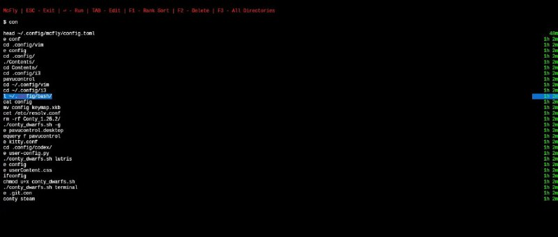

+++
title = ""
date = 2026-02-20T19:04:54+00:00
description = "bash history mcfly: ctrl-r replacement with \"suggestions are prioritized in real time with a small neural network.\" Did a color scheme for it."

[taxonomies]
days = ["2026-02-20"]
tags = ["bash", "history", "mcfly"]

[extra]
id = 1119
day = "2026-02-20"
tg_url = "https://t.me/vitaly_zdanevich_chan/1119"
og_image = "5242389218842057393_1220588856_460004017.jpg"
next_id = 1120
next_title = ""
prev_id = 1118
prev_title = ""
views = 14
ids = [1119]
+++

{{ tag(t="bash") }}
{{ tag(t="history") }}

{{ tag(t="mcfly") }}: ctrl-r replacement with "suggestions are prioritized in real time with a small neural network."

Did a [color scheme](https://github.com/cantino/mcfly/issues/479#issuecomment-3936556224) for it.

<https://github.com/cantino/mcfly>

