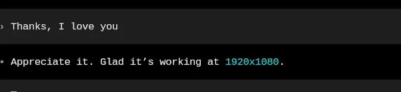

+++
title = ""
date = 2026-02-21T01:59:47+00:00
description = "ai codex love Codex, using it almost every day, recently solved a few long lasting technical problems thanks to him."

[taxonomies]
days = ["2026-02-21"]
tags = ["ai", "codex", "love"]

[extra]
id = 1120
day = "2026-02-21"
tg_url = "https://t.me/vitaly_zdanevich_chan/1120"
og_image = "5244641018655740008_1221113144_460001384.jpg"
next_id = 1121
next_title = ""
prev_id = 1119
prev_title = ""
views = 14
ids = [1120]
+++

{{ tag(t="ai") }}  
{{ tag(t="codex") }}  

{{ tag(t="love") }} [Codex](https://github.com/openai/codex), using it almost every day, recently solved a few long lasting technical problems thanks to him.

