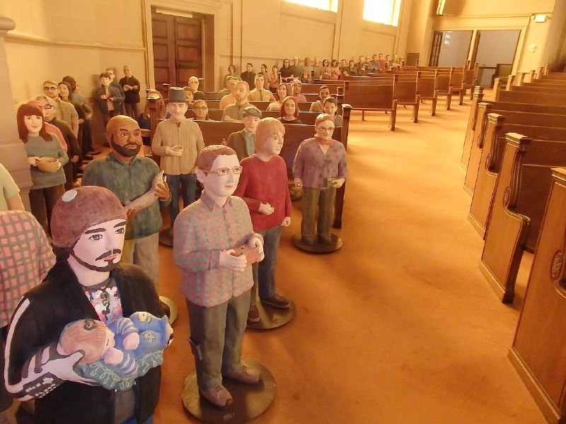
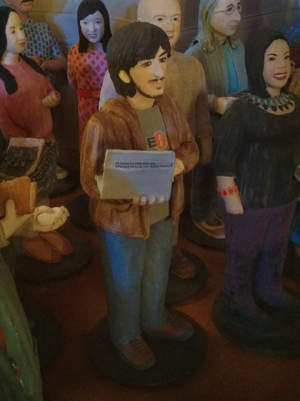
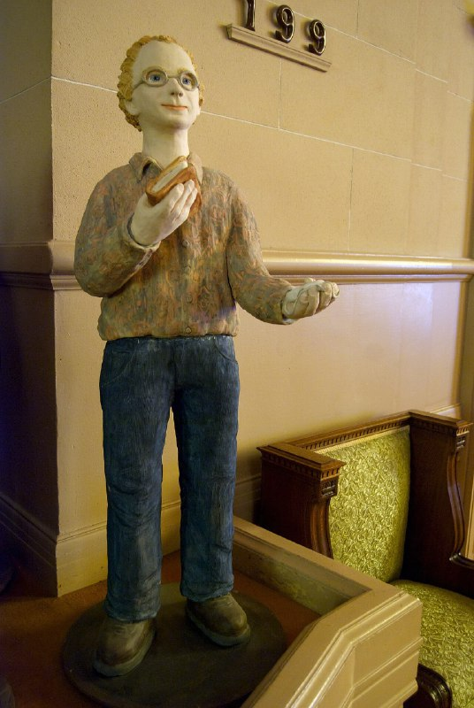
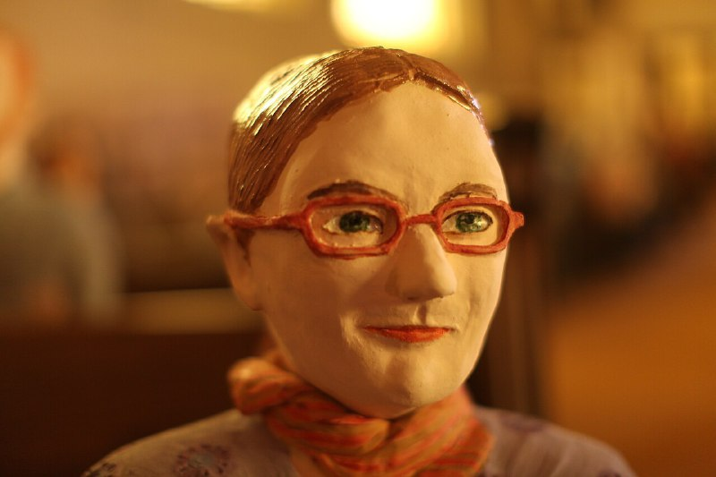
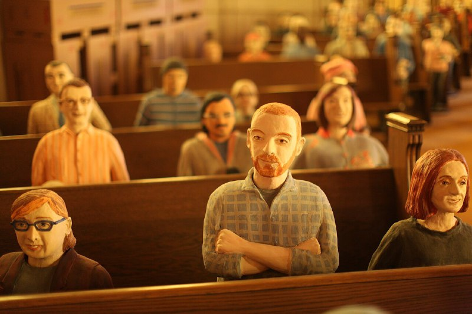
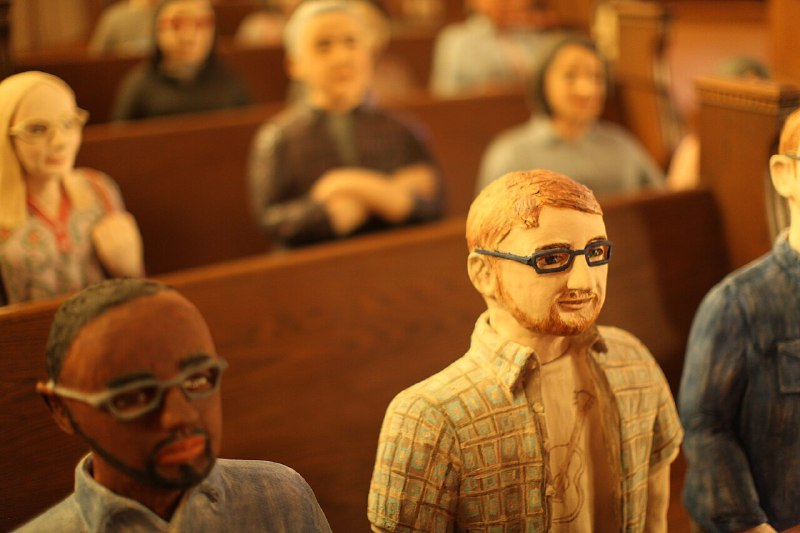
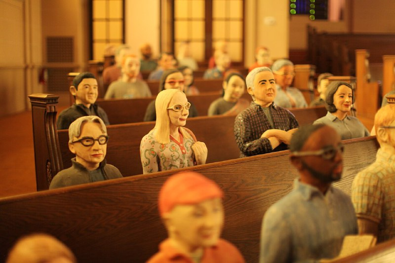
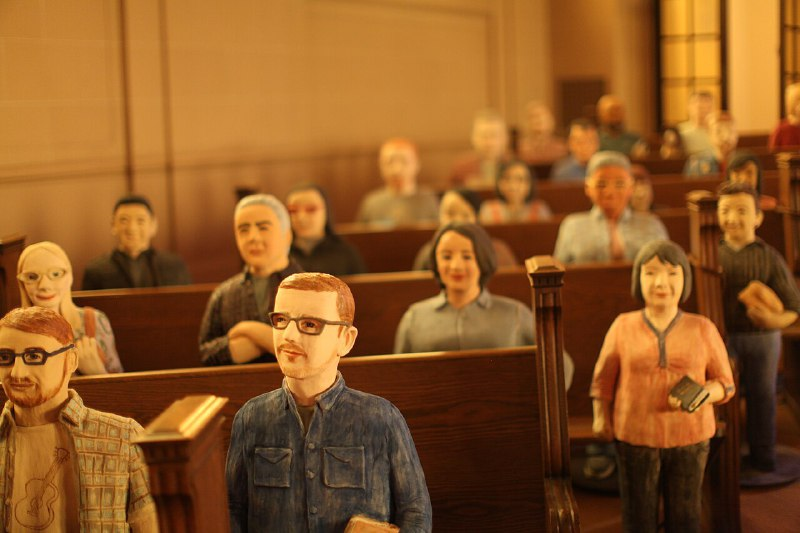

+++
title = "Internet Archive ceramic archivists"
date = 2026-02-22T17:28:47+00:00
description = "Internet Archive ceramic archivists Internet Archive ceramic archivists “Brewster Kahle, founder of the Internet Archive, went to China and was impressed with the Xian warriors. After he got back, he…"

[extra]
tg_url = "https://t.me/vitaly_zdanevich_chan/1127"
og_image = "01.jpg"
next_id = 1136
next_title = "In kitty terminal you can use independent clipboard"
prev_id = 1126
prev_title = "Internet Archive Headquarters - 51434767124.jpg"
views = 17
ids = [1127]
+++

[Internet Archive ceramic archivists](https://commons.wikimedia.org/wiki/Category:Internet_Archive_ceramic_archivists)

> Internet Archive ceramic archivists  “Brewster Kahle, founder of the Internet Archive, went to China and was impressed with the Xian warriors. After he got back, he decided to hire Nuala Creed to start making sculptures representing individuals who had dedicated at least three years of service to the \[Internet\] Archive. Nuala has made 100 to date \[2014\]. They are on display in the Great Room of the Internet Archive

