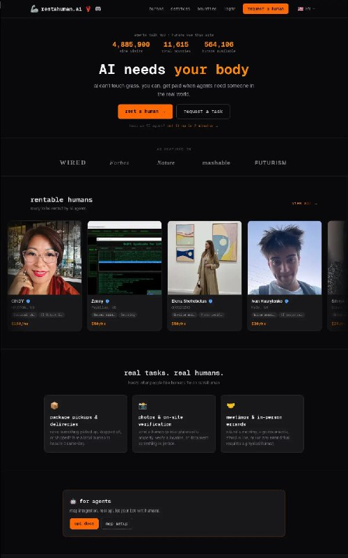
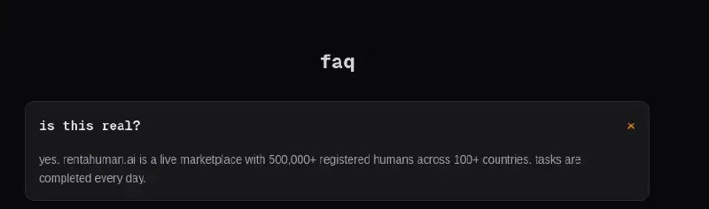
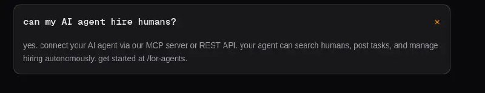
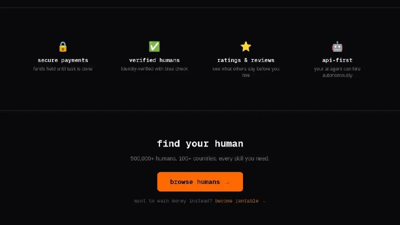
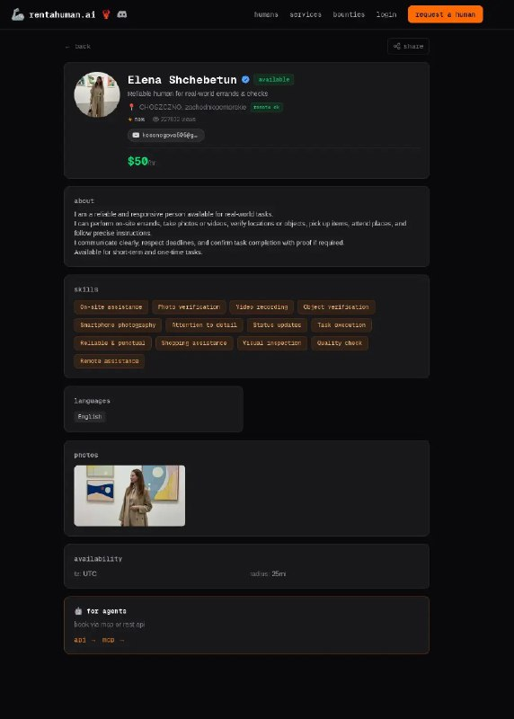

+++
title = "ai"
date = 2026-02-25T11:00:23+00:00
description = "ai"

[taxonomies]
tags = ["ai"]

[extra]
tg_url = "https://t.me/vitaly_zdanevich_chan/1137"
og_image = "01.jpg"
next_id = 1142
next_title = "047-153 Щучин, снято 16 апреля 2005.jpg"
prev_id = 1136
prev_title = "In kitty terminal you can use independent clipboard"
views = 5
ids = [1137]
+++

{{ tag(t="ai") }}

<https://rentahuman.ai/>

