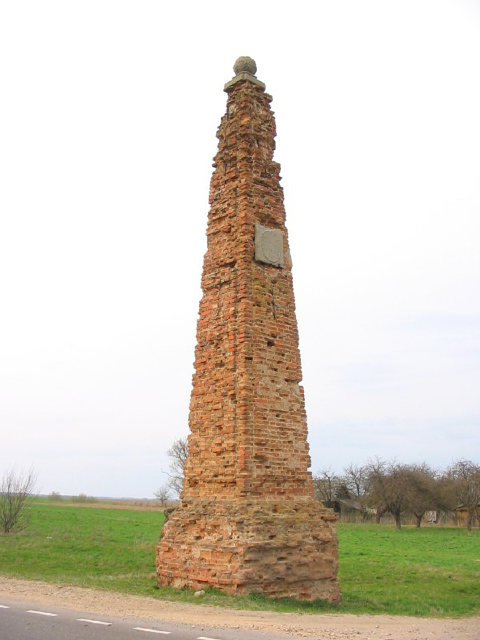
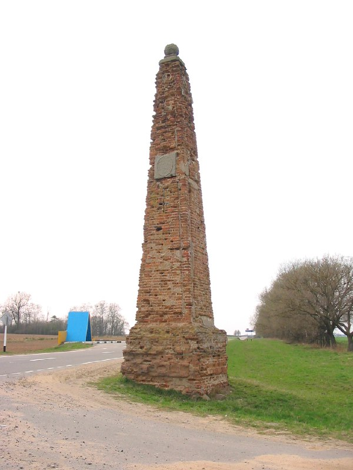

+++
title = ""
date = 2026-02-25T20:18:13+00:00
description = "obelisk belarus globustut Source"

[taxonomies]
days = ["2026-02-25"]
tags = ["obelisk", "belarus", "globustut"]

[extra]
id = 1149
day = "2026-02-25"
tg_url = "https://t.me/vitaly_zdanevich_chan/1149"
og_image = "01.jpg"
next_id = 1152
next_title = ""
next_body = "#church\n#blue\n#belarus\n#globustut\nSource,%D1%81%D0%BD%D1%8F%D1%82%D0%BE16%D0%B0%D0%BF%D1%80%D0%B5%D0%BB%D1%8F2005.jpg)"
prev_id = 1143
prev_title = ""
prev_body = "#building\n#abandone\n#belarus\n#globustut\nSource"
views = 3
ids = [1149]
+++

{{ tag(t="obelisk") }}  
{{ tag(t="belarus") }}  
{{ tag(t="globustut") }}

[Source](https://commons.wikimedia.org/wiki/File:047-381_%D0%90%D0%BB%D0%B5%D0%BA%D1%81%D0%B8%D1%87%D0%B8,_%D1%81%D0%BD%D1%8F%D1%82%D0%BE_16_%D0%B0%D0%BF%D1%80%D0%B5%D0%BB%D1%8F_2005.jpg)

