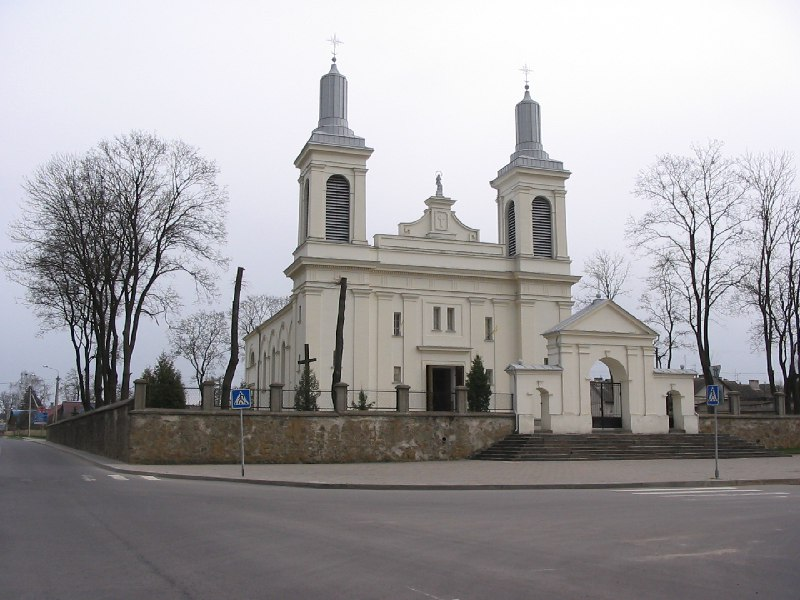
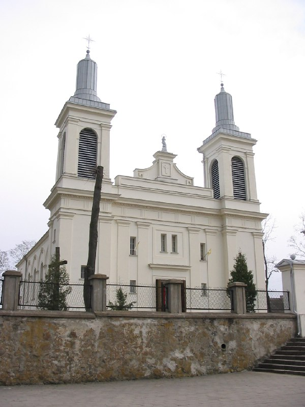
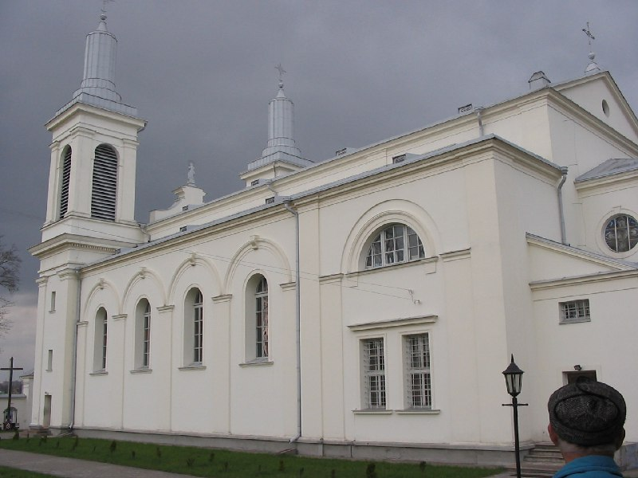
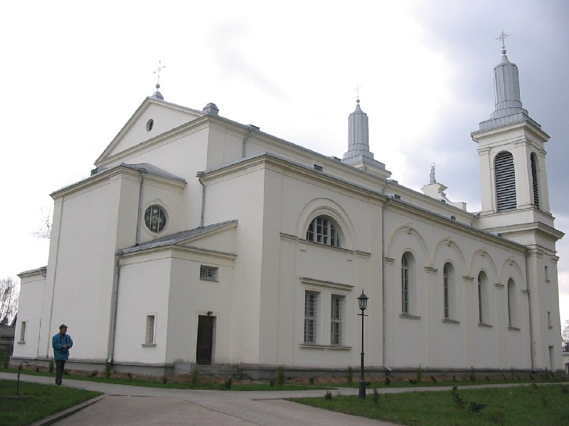

+++
title = ""
date = 2026-02-25T20:52:26+00:00
description = "church belarus abandone globustut Source"

[taxonomies]
days = ["2026-02-25"]
tags = ["church", "belarus", "abandone", "globustut"]

[extra]
id = 1171
day = "2026-02-25"
tg_url = "https://t.me/vitaly_zdanevich_chan/1171"
og_image = "01.jpg"
next_id = 1176
next_title = ""
next_body = "#monument\n#cementery\n#belarus\n#globustut\nSource"
prev_id = 1170
prev_title = ""
prev_body = "#entrance\n#abandone\n#belarus\nSource"
views = 3
ids = [1171]
+++

{{ tag(t="church") }}  
{{ tag(t="belarus") }}  
{{ tag(t="abandone") }}  
{{ tag(t="globustut") }}

[Source](https://commons.wikimedia.org/wiki/File:048-221_%D0%92%D0%BE%D0%BB%D0%BA%D0%BE%D0%B2%D1%8B%D1%81%D0%BA,_%D1%81%D0%BD%D1%8F%D1%82%D0%BE_23_%D0%B0%D0%BF%D1%80%D0%B5%D0%BB%D1%8F_2005.jpg)

