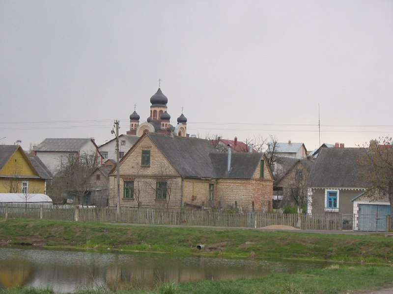

+++
title = ""
date = 2026-02-25T20:57:40+00:00
description = "church architecture belarus globustut Source"

[taxonomies]
days = ["2026-02-25"]
tags = ["church", "architecture", "belarus", "globustut"]

[extra]
id = 1178
day = "2026-02-25"
tg_url = "https://t.me/vitaly_zdanevich_chan/1178"
og_image = "5258160909983619873_1224260989_460004129.jpg"
next_id = 1179
next_title = ""
next_body = "#architecture\n#cream\n#belarus\n#globustut\nSource"
prev_id = 1176
prev_title = ""
prev_body = "#monument\n#cementery\n#belarus\n#globustut\nSource"
views = 3
ids = [1178]
+++

{{ tag(t="church") }}  
{{ tag(t="architecture") }}  
{{ tag(t="belarus") }}  
{{ tag(t="globustut") }}  

[Source](https://commons.wikimedia.org/wiki/File:048-284_%D0%9A%D1%80%D0%B0%D1%81%D0%BD%D0%BE%D1%81%D0%B5%D0%BB%D1%8C%D1%81%D0%BA%D0%B8%D0%B9,_%D1%86%D0%B5%D1%80%D0%BA%D0%BE%D0%B2%D1%8C_%D0%B8%D0%B7%D0%B4%D0%B0%D0%BB%D0%B8,_%D1%81%D0%BD%D1%8F%D1%82%D0%BE_23_%D0%B0%D0%BF%D1%80%D0%B5%D0%BB%D1%8F_2005.jpg)

