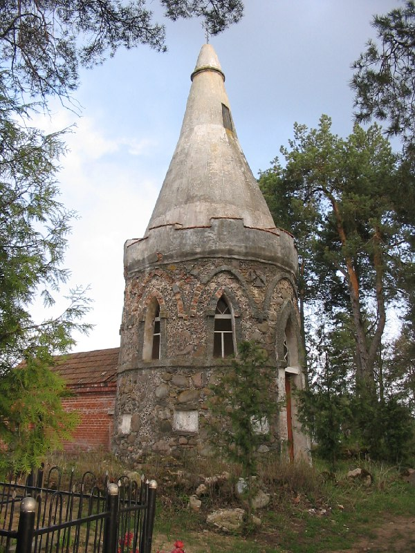
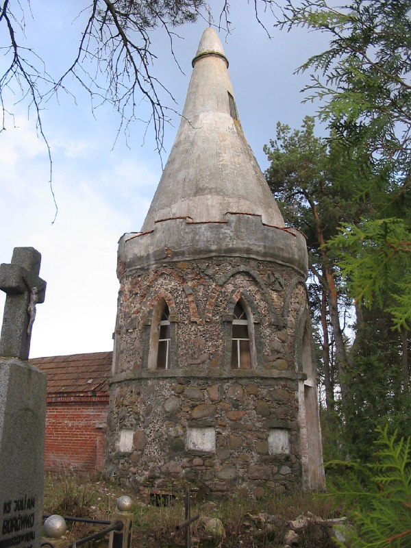
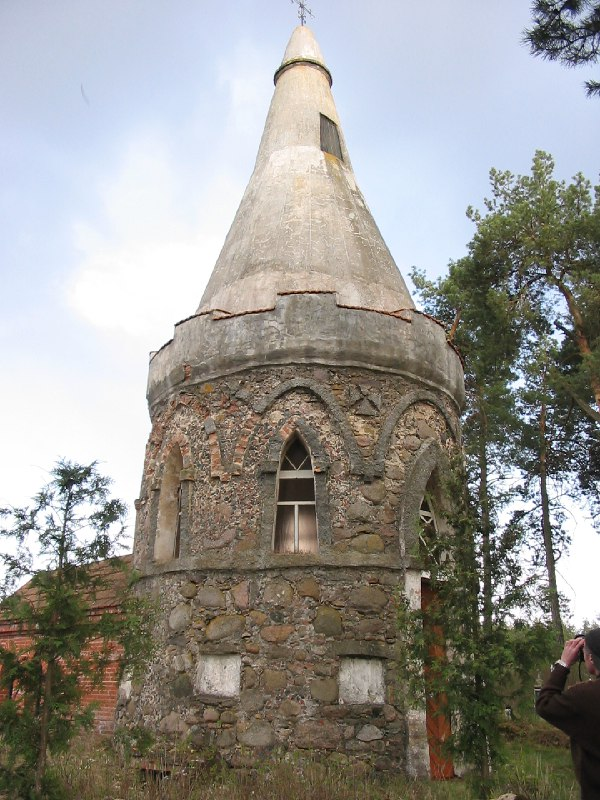
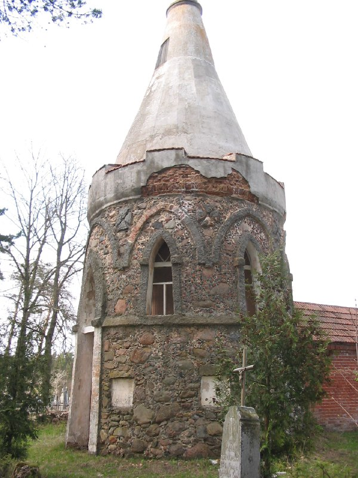
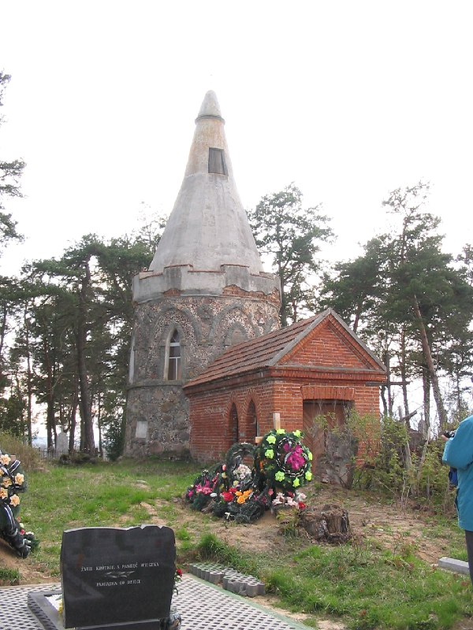
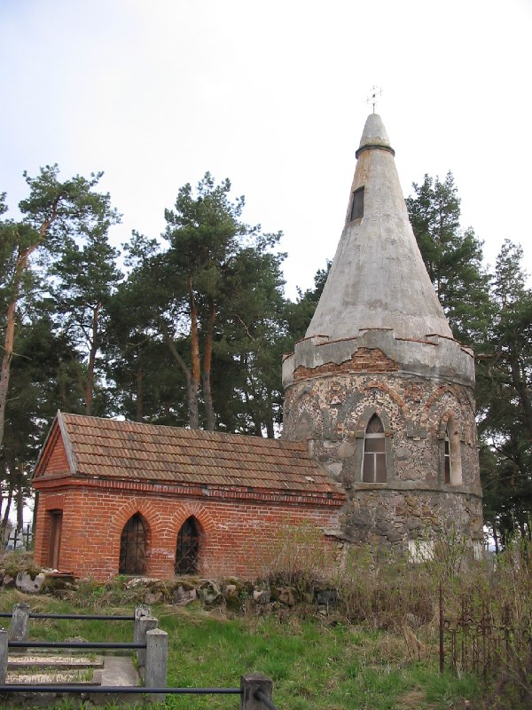
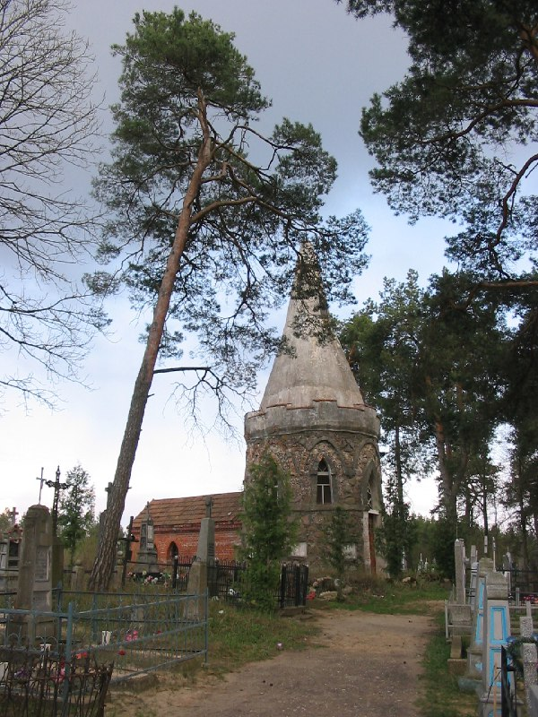

+++
title = ""
date = 2026-02-25T23:04:54+00:00
description = "tower cementery belarus globustut Source"

[taxonomies]
days = ["2026-02-25"]
tags = ["tower", "cementery", "belarus", "globustut"]

[extra]
id = 1188
day = "2026-02-25"
tg_url = "https://t.me/vitaly_zdanevich_chan/1188"
og_image = "01.jpg"
next_id = 1195
next_title = ""
next_body = "#architecture\n#blue\n#window\n#belarus\n#globustut\nSource"
prev_id = 1181
prev_title = ""
prev_body = "#belfry\n#belarus\n#globustut\nSource"
views = 4
ids = [1188]
+++

{{ tag(t="tower") }}  
{{ tag(t="cementery") }}  
{{ tag(t="belarus") }}  
{{ tag(t="globustut") }}

[Source](https://commons.wikimedia.org/wiki/File:048-390_%D0%A0%D0%B5%D0%BF%D0%BB%D1%8F,_%D1%87%D0%B0%D1%81%D0%BE%D0%B2%D0%BD%D1%8F_%D0%BD%D0%B0_%D0%BA%D0%BB%D0%B0%D0%B4%D0%B1%D0%B8%D1%89%D0%B5,_%D1%81%D0%BD%D1%8F%D1%82%D0%BE_23_%D0%B0%D0%BF%D1%80%D0%B5%D0%BB%D1%8F_2005.jpg)

