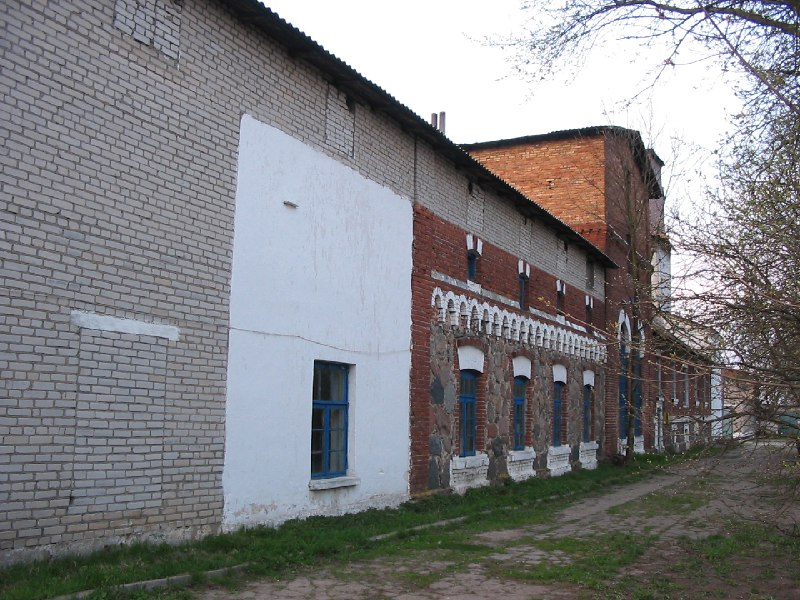

+++
title = ""
date = 2026-02-25T23:09:38+00:00
description = "architecture blue window belarus globustutSource"

[taxonomies]
days = ["2026-02-25"]
tags = ["architecture", "blue", "window", "belarus", "globustut"]

[extra]
id = 1195
day = "2026-02-25"
tg_url = "https://t.me/vitaly_zdanevich_chan/1195"
og_image = "5260412709797302305_1224785277_460001313.jpg"
next_id = 1196
next_title = ""
prev_id = 1188
prev_title = ""
views = 3
ids = [1195]
+++

{{ tag(t="architecture") }}  
{{ tag(t="blue") }}  
{{ tag(t="window") }}  
{{ tag(t="belarus") }}  
{{ tag(t="globustut") }}[Source](https://commons.wikimedia.org/wiki/File:048-449_%D0%97%D0%BB%D0%BE%D0%B1%D0%BE%D0%B2%D1%89%D0%B8%D0%BD%D0%B0,_%D1%81%D0%BF%D0%B8%D1%80%D1%82%D0%B7%D0%B0%D0%B2%D0%BE%D0%B4,_%D1%81%D0%BD%D1%8F%D1%82%D0%BE_23_%D0%B0%D0%BF%D1%80%D0%B5%D0%BB%D1%8F_2005.jpg)

