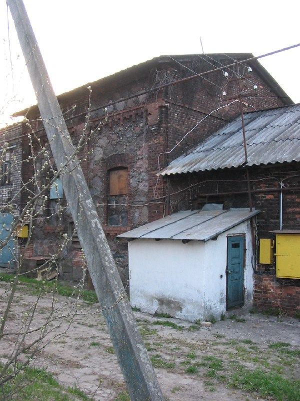

+++
title = ""
date = 2026-02-25T23:15:37+00:00
description = "abandone dark belarus globustut year2005 Source"

[taxonomies]
days = ["2026-02-25"]
tags = ["abandone", "dark", "belarus", "globustut", "year_2005"]

[extra]
id = 1196
day = "2026-02-25"
tg_url = "https://t.me/vitaly_zdanevich_chan/1196"
og_image = "5260412709797302306_1224785277_460001314.jpg"
next_id = 1197
next_title = ""
next_body = "#firefox\n#extension\nCopy non-latin links without #percent"
prev_id = 1195
prev_title = ""
prev_body = "#architecture\n#blue\n#window\n#belarus\n#globustut\nSource"
views = 3
ids = [1196]
+++

{{ tag(t="abandone") }}  
{{ tag(t="dark") }}  
{{ tag(t="belarus") }}  
{{ tag(t="globustut") }}  
{{ tag(t="year_2005") }}

[Source](https://commons.wikimedia.org/wiki/File:048-454_%D0%97%D0%BB%D0%BE%D0%B1%D0%BE%D0%B2%D1%89%D0%B8%D0%BD%D0%B0,_%D0%BC%D0%B5%D0%BD%D1%8C%D1%88%D0%B8%D0%B9_%D0%BA%D0%BE%D1%80%D0%BF%D1%83%D1%81,_%D1%81%D0%BD%D1%8F%D1%82%D0%BE_23_%D0%B0%D0%BF%D1%80%D0%B5%D0%BB%D1%8F_2005.jpg)

