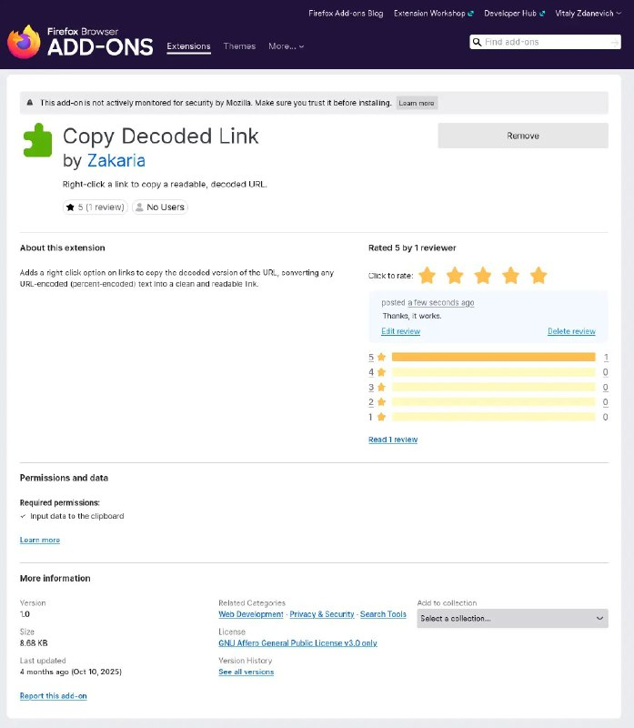

+++
title = ""
date = 2026-02-25T23:19:16+00:00
description = "firefox extension Copy non-latin links without percent"

[taxonomies]
days = ["2026-02-25"]
tags = ["firefox", "extension", "percent"]

[extra]
id = 1197
day = "2026-02-25"
tg_url = "https://t.me/vitaly_zdanevich_chan/1197"
og_image = "5260412709797302308_1224785277_460001316.jpg"
next_id = 1198
next_title = ""
prev_id = 1196
prev_title = ""
views = 2
ids = [1197]
+++

{{ tag(t="firefox") }}  
{{ tag(t="extension") }}  

Copy non-latin links without {{ tag(t="percent") }} <https://addons.mozilla.org/en-US/firefox/addon/copy-decoded-link/>

