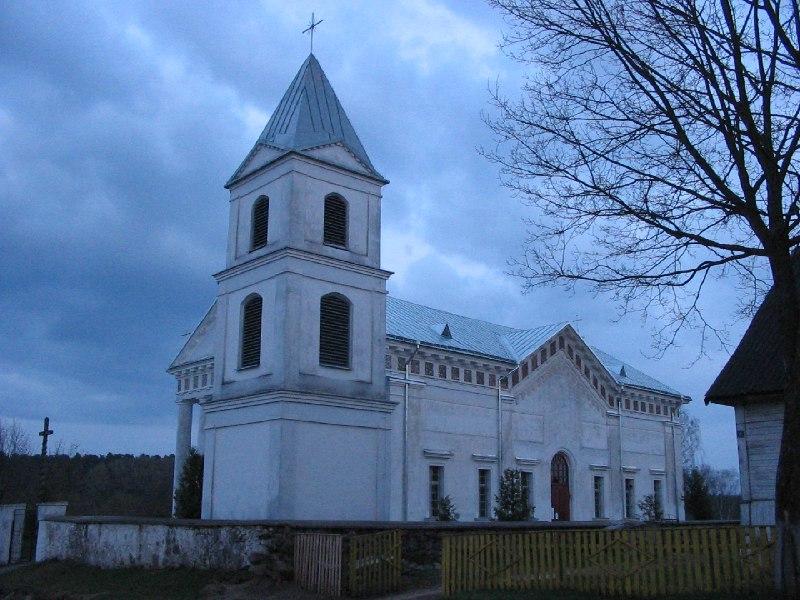
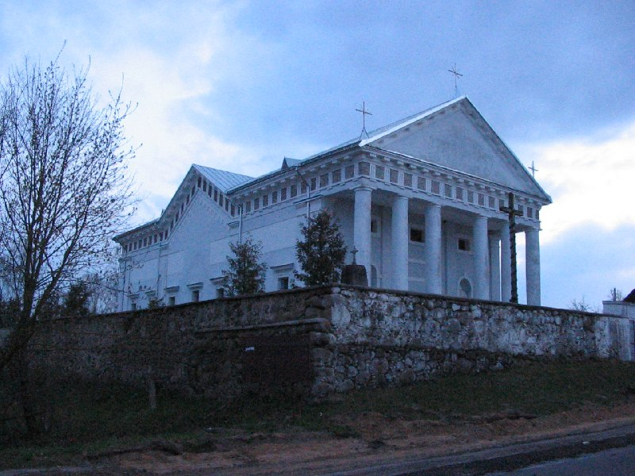

+++
title = ""
date = 2026-02-25T23:50:39+00:00
description = "church blue belarus globustut year2005 Source,%D1%81%D0%BD%D1%8F%D1%82%D0%BE23%D0%B0%D0%BF%D1%80%D0%B5%D0%BB%D1%8F2005.jpg)"

[taxonomies]
days = ["2026-02-25"]
tags = ["church", "blue", "belarus", "globustut", "year_2005"]

[extra]
id = 1198
day = "2026-02-25"
tg_url = "https://t.me/vitaly_zdanevich_chan/1198"
og_image = "01.jpg"
next_id = 1200
next_title = ""
next_body = "#27февраля2026 (пт) 21.30-01:00 Hard IT в Laboratory Bar\n#безоплаты\nДоклады:\n1. [Hard] MCP Servers Security (🧑‍💻@alexkutsan)\n2. [Hard] Что такое chroot(🧑‍💻@vitalyzdanevich)\n🤔 Ты тоже можешь выступить с докладом в неформальной обстановке на большом экране.\nДокладчику – пивас в подарок! ☕️🍺\nУже 2й год подряд мы проводим Friday-IT сходки в Laboratory Bar! За это время было рассказано и показано более 160 уникальных докладов 🔥 на самые разные темы.\n➡️Расписание\n🗓 21:00-21:50 - Сбор\n💬 21:50-22:10 - Знакомимся с Крякой\n🍺22:10-22:20 - Запасаемся пивом/медовухой/кальяном\n👨‍🏫22:30 - Конкурс мокрых маек Первый доклад\n🍺22:50-23:00 - Возобновляем запасы пива/кальяна\n👨‍🏫23:10-23:50 - Второй доклад\n🤼00:00-до последнего итишника - Разговоры о высоком/Игры в шахматы/Караоке\n📍Адрес: Laboratory bar (Генерала Мазниашвили 66)\n⏰ 21:30-до последнего итишника\n💬 Все вопросы – в личку: @marstut"
prev_id = 1197
prev_title = ""
prev_body = "#firefox\n#extension\nCopy non-latin links without #percent"
views = 6
ids = [1198]
+++

{{ tag(t="church") }}  
{{ tag(t="blue") }}  
{{ tag(t="belarus") }}  
{{ tag(t="globustut") }}  
{{ tag(t="year_2005") }}

[Source](https://commons.wikimedia.org/wiki/File:048-474_%D0%92%D0%B5%D1%80%D0%B5%D0%B9%D0%BA%D0%B8,_%D0%BA%D0%BE%D1%81%D1%82%D0%B5%D0%BB_(%D1%82%D0%B5%D0%BC%D0%BD%D0%BE),_%D1%81%D0%BD%D1%8F%D1%82%D0%BE_23_%D0%B0%D0%BF%D1%80%D0%B5%D0%BB%D1%8F_2005.jpg)

