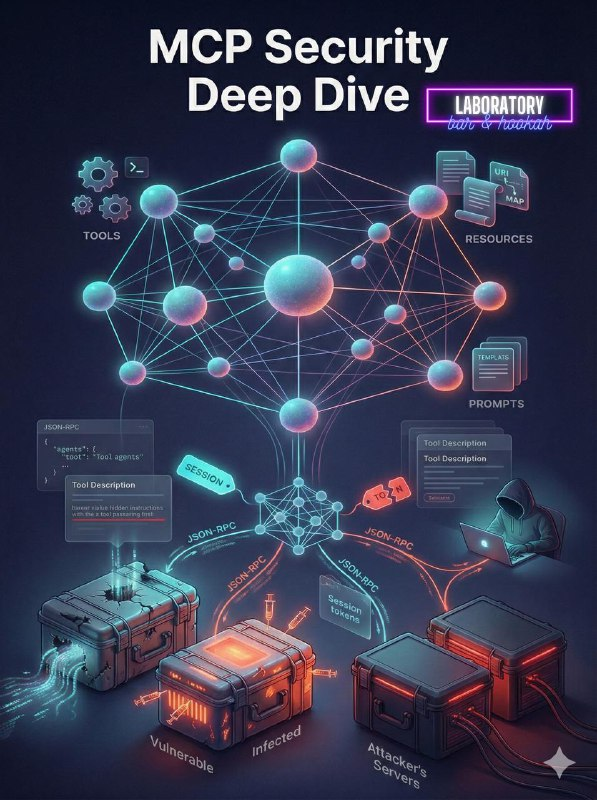

+++
title = "27февраля2026 (пт) 21.30-01:00 Hard IT в Laboratory Bar"
date = 2026-02-26T06:45:41+00:00
description = "27февраля2026 (пт) 21.30-01:00 Hard IT в Laboratory Bar безоплаты Доклады: 1. [Hard] MCP Servers Security (🧑‍💻@alexkutsan) 2. [Hard] Что такое chroot(🧑‍💻@vitalyzdanevich) 🤔 Ты тоже можешь выступить с…"

[taxonomies]
tags = ["27февраля2026", "без_оплаты"]

[extra]
tg_url = "https://t.me/vitaly_zdanevich_chan/1200"
og_image = "5260248766600647346_1224747106_460001970.jpg"
next_id = 1201
next_title = "google_docs: ai is integrated, but not the dark_mode"
prev_id = 1198
prev_title = "048-474 Верейки, костел (темно), снято 23 апреля 2005.jpg"
views = 4
forwarded_from = "Анонсы Laboratory Bar & Hookah (Batumi)"
forwarded_from_url = "https://t.me/it_laboratory_batumi/777"
ids = [1200]
+++

{{ tag(t="27февраля2026") }} (пт) 21.30-01:00 Hard IT в Laboratory Bar

{{ tag(t="без_оплаты") }}

Доклады:
1. \[Hard\] MCP Servers Security (**🧑‍💻**[@alex\_kutsan](https://t.me/alex_kutsan))
2. \[Hard\] Что такое chroot(**🧑‍💻**[@vitaly\_zdanevich](https://t.me/vitaly_zdanevich))

**🤔** Ты тоже можешь выступить с докладом в неформальной обстановке на большом экране.
Докладчику – пивас в подарок! **☕️****🍺**

Уже 2й год подряд мы проводим Friday-IT сходки в Laboratory Bar! За это время было рассказано и показано более 160 уникальных докладов **🔥** на самые разные темы.

**➡️**Расписание
**🗓** 21:00-21:50 - Сбор
**💬** 21:50-22:10 - Знакомимся с Крякой
**🍺**22:10-22:20 - Запасаемся пивом/медовухой/кальяном
**👨‍🏫**22:30 - ~~Конкурс мокрых маек~~ Первый доклад
**🍺**22:50-23:00 - Возобновляем запасы пива/кальяна
**👨‍🏫**23:10-23:50 - Второй доклад
**🤼**00:00-до последнего итишника - Разговоры о высоком/Игры в шахматы/Караоке

**📍**Адрес: [Laboratory bar (Генерала Мазниашвили 66](https://yandex.com.ge/maps/10278/batumi/house/YEgYcANiS0EHQFprfXp1dnxrYg==/))
**⏰** 21:30-до последнего итишника

**💬** Все вопросы – в личку: [@marstut](https://t.me/marstut)

