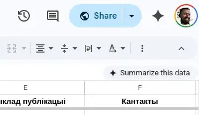

+++
title = ""
date = 2026-02-27T01:34:51+00:00
description = "googledocs: ai is integrated, but not the darkmode If you do not know about this css property"

[taxonomies]
days = ["2026-02-27"]
tags = ["google_docs", "ai", "dark_mode", "css"]

[extra]
id = 1201
day = "2026-02-27"
tg_url = "https://t.me/vitaly_zdanevich_chan/1201"
og_image = "5262671347198925503_1225311157_460004031.jpg"
next_id = 1202
next_title = ""
prev_id = 1200
prev_title = ""
views = 9
ids = [1201]
+++

{{ tag(t="google_docs") }}: {{ tag(t="ai") }} is integrated, but not the {{ tag(t="dark_mode") }}  

If you do not know about this {{ tag(t="css") }} property  
<https://developer.mozilla.org/en-US/docs/Web/CSS/@media/prefers-color-scheme>

