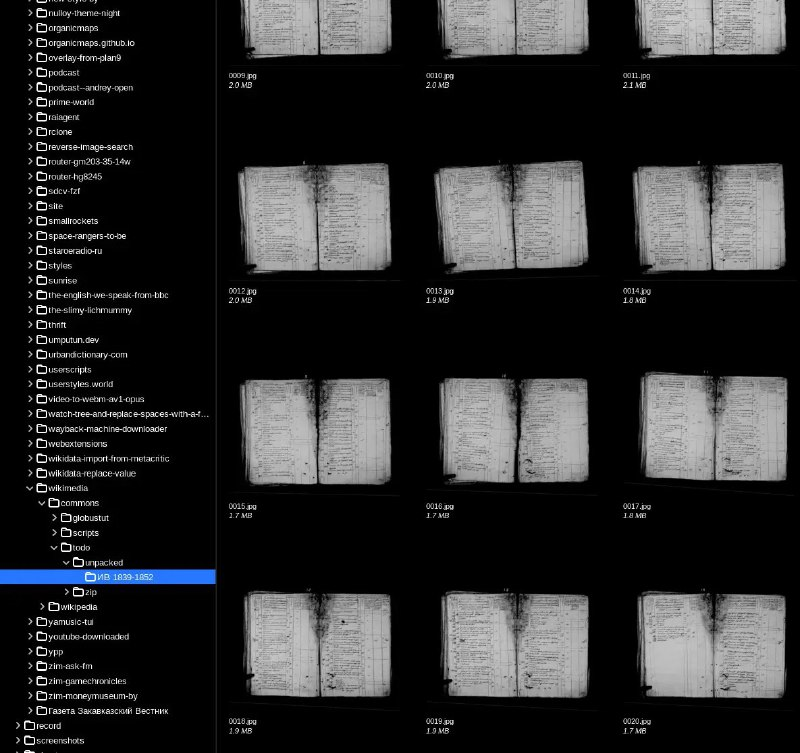

+++
title = ""
date = 2026-02-27T22:22:22+00:00
description = "design software gthumb scan preservation"

[taxonomies]
days = ["2026-02-27"]
tags = ["design", "software", "gthumb", "scan", "preservation"]

[extra]
id = 1203
day = "2026-02-27"
tg_url = "https://t.me/vitaly_zdanevich_chan/1203"
og_image = "5264957012829737976_1225843330_460002296.jpg"
next_id = 1204
next_title = ""
next_body = "#calligraphy\n#microfilm\n#preservation"
prev_id = 1202
prev_title = ""
prev_body = "My new #userscript for #evernote adds a few #hotkey"
views = 6
ids = [1203]
+++

{{ tag(t="design") }}  
{{ tag(t="software") }}  
{{ tag(t="gthumb") }}  
{{ tag(t="scan") }}  
{{ tag(t="preservation") }}

