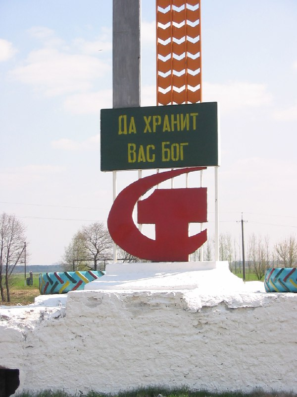
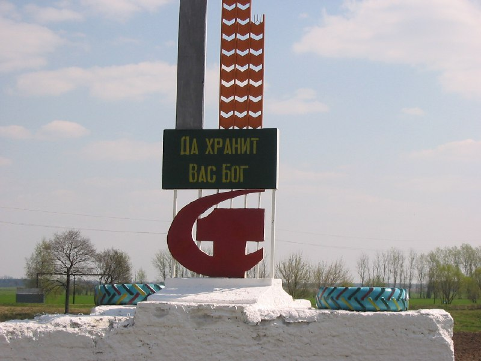

+++
title = ""
date = 2026-02-28T01:14:23+00:00
description = "ussr god conflict belarus globustut year2005 Да хранит вас Бог Source"

[taxonomies]
days = ["2026-02-28"]
tags = ["ussr", "god", "conflict", "belarus", "globustut", "year_2005"]

[extra]
id = 1205
day = "2026-02-28"
tg_url = "https://t.me/vitaly_zdanevich_chan/1205"
og_image = "01.jpg"
next_id = 1208
next_title = ""
prev_id = 1204
prev_title = ""
views = 5
ids = [1205]
+++

{{ tag(t="ussr") }}  
{{ tag(t="god") }}  
{{ tag(t="conflict") }}  
{{ tag(t="belarus") }}  
{{ tag(t="globustut") }}  
{{ tag(t="year_2005") }}  

> Да хранит вас Бог
[Source](https://commons.wikimedia.org/wiki/File:051-041_%D0%BC%D0%B5%D0%B6_%D0%9E%D0%B7%D0%B0%D1%80%D0%B8%D1%87%D0%B8_%D0%B8_%D0%92%D0%B0%D0%BB%D0%B8%D1%89%D0%B5,_%D1%81%D0%BD%D1%8F%D1%82%D0%BE_30_%D0%B0%D0%BF%D1%80%D0%B5%D0%BB%D1%8F_2005.jpg)

