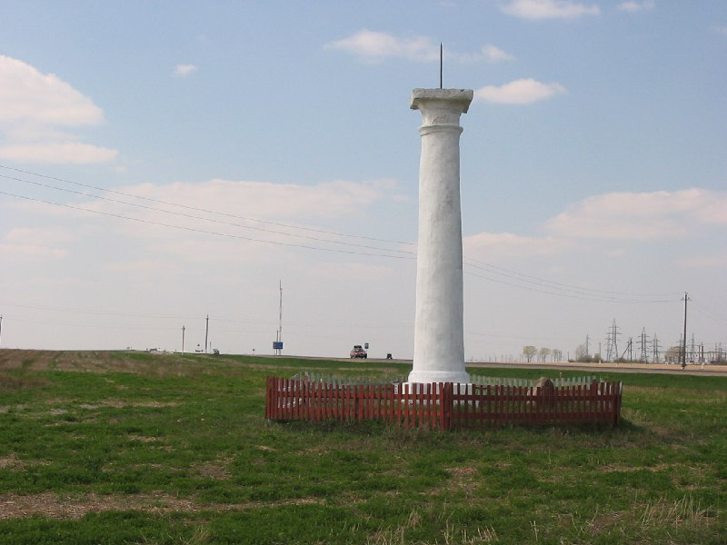

+++
title = ""
date = 2026-02-28T01:15:30+00:00
description = "belarus abandone globustut year2005 Source"

[taxonomies]
days = ["2026-02-28"]
tags = ["belarus", "abandone", "globustut", "year_2005"]

[extra]
id = 1208
day = "2026-02-28"
tg_url = "https://t.me/vitaly_zdanevich_chan/1208"
og_image = "5264957012829738042_1225843330_460002362.jpg"
next_id = 1209
next_title = ""
next_body = "#column\n#belarus\n#abandone\n#globustut\n#year2005\nSource,%D0%B1%D1%80%D0%B0%D0%BC%D0%B0,%D1%81%D0%BD%D1%8F%D1%82%D0%BE30%D0%B0%D0%BF%D1%80%D0%B5%D0%BB%D1%8F2005.jpg)"
prev_id = 1205
prev_title = ""
prev_body = "#ussr\n#god\n#conflict\n#belarus\n#globustut\n#year2005\nДа хранит вас Бог\nSource"
views = 4
ids = [1208]
+++

{{ tag(t="belarus") }}  
{{ tag(t="abandone") }}  
{{ tag(t="globustut") }}  
{{ tag(t="year_2005") }}  

[Source](https://commons.wikimedia.org/wiki/File:051-135_%D0%9E%D1%81%D0%BD%D0%B5%D0%B6%D0%B8%D1%86%D1%8B,_%D1%81%D0%BD%D1%8F%D1%82%D0%BE_30_%D0%B0%D0%BF%D1%80%D0%B5%D0%BB%D1%8F_2005.jpg)

