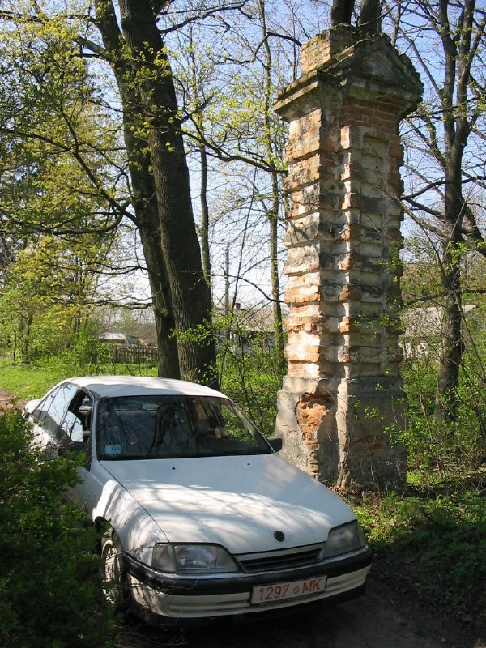

+++
title = ""
date = 2026-02-28T01:16:46+00:00
description = "column belarus abandone globustut year2005 Source,%D0%B1%D1%80%D0%B0%D0%BC%D0%B0,%D1%81%D0%BD%D1%8F%D1%82%D0%BE30%D0%B0%D0%BF%D1%80%D0%B5%D0%BB%D1%8F2005.jpg)"

[taxonomies]
days = ["2026-02-28"]
tags = ["column", "belarus", "abandone", "globustut", "year_2005"]

[extra]
id = 1209
day = "2026-02-28"
tg_url = "https://t.me/vitaly_zdanevich_chan/1209"
og_image = "01.jpg"
next_id = 1212
next_title = ""
prev_id = 1208
prev_title = ""
views = 6
ids = [1209]
+++

{{ tag(t="column") }}  
{{ tag(t="belarus") }}  
{{ tag(t="abandone") }}  
{{ tag(t="globustut") }}  
{{ tag(t="year_2005") }}  

[Source](https://commons.wikimedia.org/wiki/File:051-394_%D0%94%D1%83%D0%B1%D0%BE%D0%B9_(%D0%9F%D0%B8%D0%BD%D1%81%D0%BA%D0%B8%D0%B9_%D1%80-%D0%BD),_%D0%B1%D1%80%D0%B0%D0%BC%D0%B0,_%D1%81%D0%BD%D1%8F%D1%82%D0%BE_30_%D0%B0%D0%BF%D1%80%D0%B5%D0%BB%D1%8F_2005.jpg)

