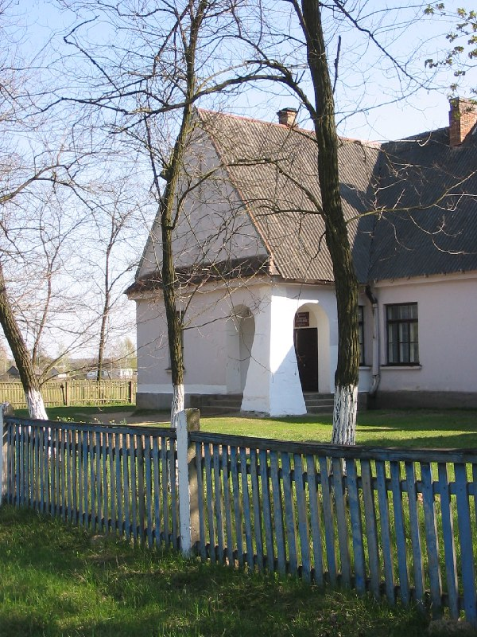

+++
title = ""
date = 2026-02-28T01:43:18+00:00
description = "architecture column white belarus globustut year2005 Source"

[taxonomies]
days = ["2026-02-28"]
tags = ["architecture", "column", "white", "belarus", "globustut", "year_2005"]

[extra]
id = 1222
day = "2026-02-28"
tg_url = "https://t.me/vitaly_zdanevich_chan/1222"
og_image = "5264957012829738064_1225843330_460002384.jpg"
next_id = 1223
next_title = ""
next_body = "#grave\n#abandone\n#belarus\n#globustut\n#year2005\nSource"
prev_id = 1212
prev_title = ""
prev_body = "#grave\n#abandone\n#belarus\n#globustut\n#year2005\nSource,%D1%81%D0%BD%D1%8F%D1%82%D0%BE30%D0%B0%D0%BF%D1%80%D0%B5%D0%BB%D1%8F2005.jpg)"
views = 5
ids = [1222]
+++

{{ tag(t="architecture") }}  
{{ tag(t="column") }}  
{{ tag(t="white") }}  
{{ tag(t="belarus") }}  
{{ tag(t="globustut") }}  
{{ tag(t="year_2005") }}  

[Source](https://commons.wikimedia.org/wiki/File:051-493_%D0%9E%D0%B3%D0%BE%D0%B2%D0%BE,_%D1%81%D0%BD%D1%8F%D1%82%D0%BE_30_%D0%B0%D0%BF%D1%80%D0%B5%D0%BB%D1%8F_2005.jpg)

