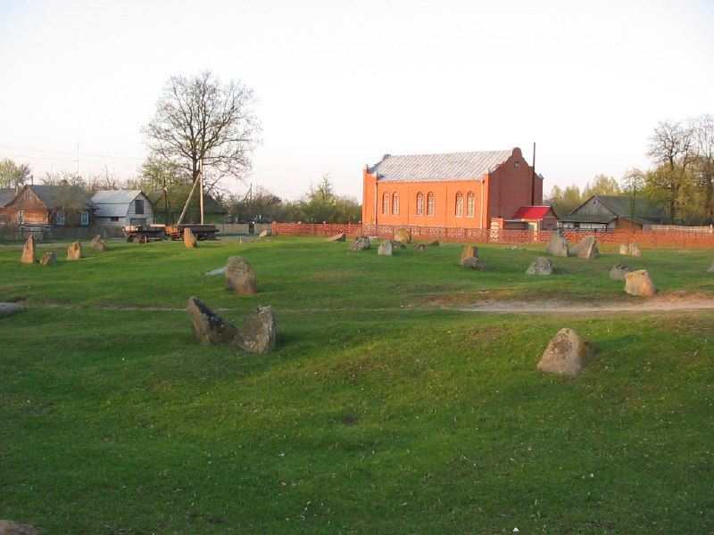
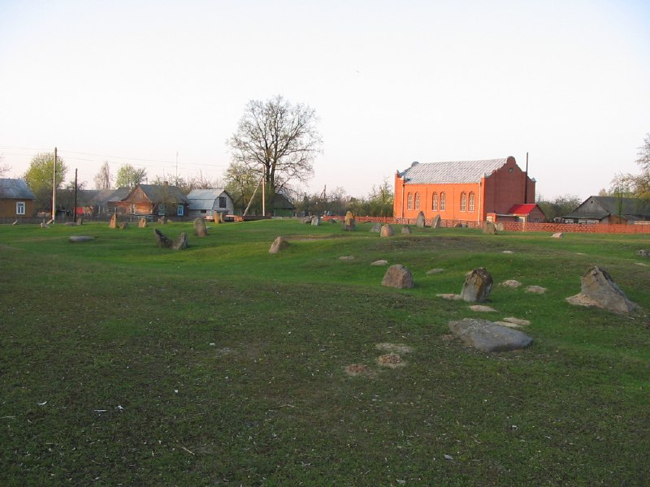
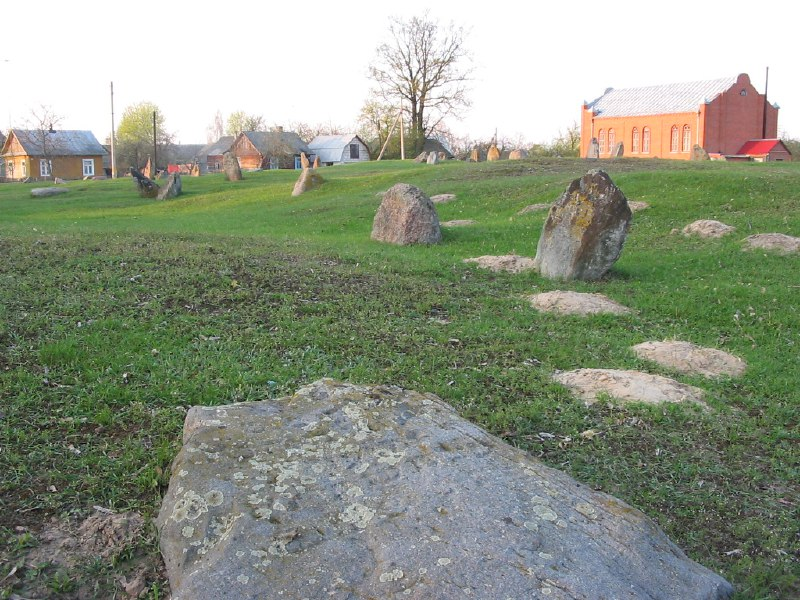
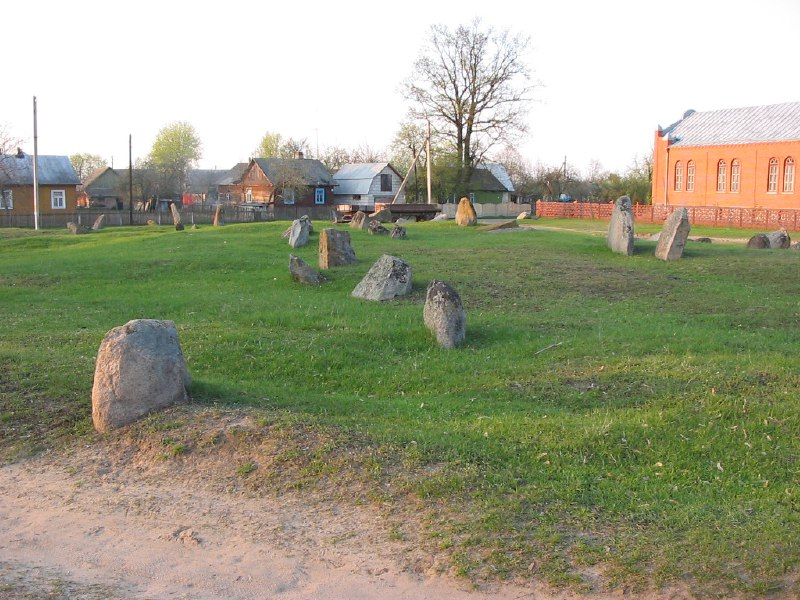

+++
title = ""
date = 2026-02-28T01:49:34+00:00
description = "grave stones belarus globustut year2005 Source"

[taxonomies]
days = ["2026-02-28"]
tags = ["grave", "stones", "belarus", "globustut", "year_2005"]

[extra]
id = 1236
day = "2026-02-28"
tg_url = "https://t.me/vitaly_zdanevich_chan/1236"
og_image = "01.jpg"
next_id = 1240
next_title = ""
next_body = "#cross\n#belarus\n#globustut\n#year2005\nSource"
prev_id = 1226
prev_title = ""
prev_body = "#church\n#abandone\n#belarus\n#globustut\n#year2005\nSource"
views = 8
ids = [1236]
+++

{{ tag(t="grave") }}  
{{ tag(t="stones") }}  
{{ tag(t="belarus") }}  
{{ tag(t="globustut") }}  
{{ tag(t="year_2005") }}  

[Source](https://commons.wikimedia.org/wiki/File:051-698_%D0%90%D0%BD%D1%82%D0%BE%D0%BF%D0%BE%D0%BB%D1%8C,_%D1%81%D0%BD%D1%8F%D1%82%D0%BE_30_%D0%B0%D0%BF%D1%80%D0%B5%D0%BB%D1%8F_2005.jpg)

