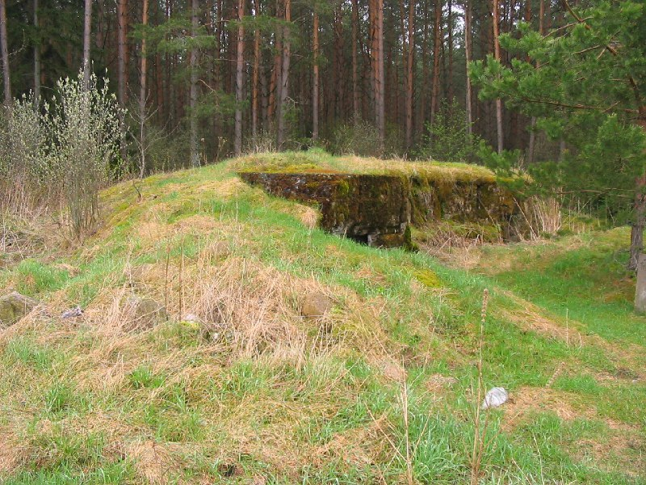
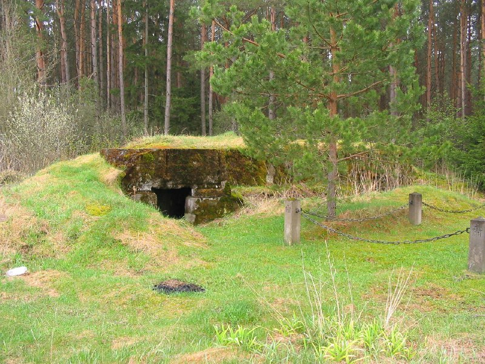

+++
title = ""
date = 2026-02-28T08:21:52+00:00
description = "cemetery belarus globustut year2005 Source"

[taxonomies]
days = ["2026-02-28"]
tags = ["cemetery", "belarus", "globustut", "year_2005"]

[extra]
id = 1246
day = "2026-02-28"
tg_url = "https://t.me/vitaly_zdanevich_chan/1246"
og_image = "01.jpg"
next_id = 1248
next_title = ""
next_body = "#cementery\n#belarus\n#globustut\n#year2005\nSource,%D1%81%D0%BD%D1%8F%D1%82%D0%BE7%D0%BC%D0%B0%D1%8F2005.jpg)"
prev_id = 1240
prev_title = ""
prev_body = "#cross\n#belarus\n#globustut\n#year2005\nSource"
views = 5
ids = [1246]
+++

{{ tag(t="cemetery") }}  
{{ tag(t="belarus") }}  
{{ tag(t="globustut") }}  
{{ tag(t="year_2005") }}  

[Source](https://commons.wikimedia.org/wiki/File:052-023_%D0%A1%D0%BB%D0%B0%D0%B9%D0%BA%D0%BE%D0%B2%D1%89%D0%B8%D0%BD%D0%B0,_%D1%81%D0%BD%D1%8F%D1%82%D0%BE_7_%D0%BC%D0%B0%D1%8F_2005.jpg)

