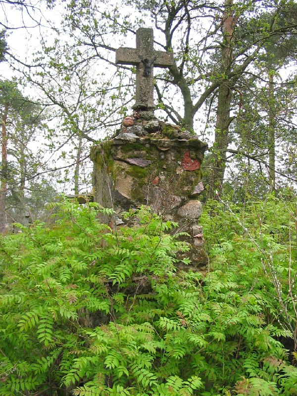

+++
title = "052-061 Вишнево (Волож р-н), снято 7 мая 2005.jpg"
date = 2026-02-28T09:07:35+00:00
description = "052-061 Вишнево (Волож р-н), снято 7 мая 2005.jpg cross monument belarus globustut year2005"

[taxonomies]
tags = ["cross", "monument", "belarus", "globustut", "year_2005"]

[extra]
tg_url = "https://t.me/vitaly_zdanevich_chan/1258"
og_image = "5264957012829738517_1225843330_460002837.jpg"
next_id = 1259
next_title = "052-085 Вишнево (Волож р-н), напротив костела, снято 7 мая 2005.jpg"
prev_id = 1255
prev_title = "052-060 Вишнево (Волож р-н), снято 7 мая 2005.jpg"
views = 5
ids = [1258]
+++

[052-061 Вишнево (Волож р-н), снято 7 мая 2005.jpg](https://commons.wikimedia.org/wiki/File:052-061_%D0%92%D0%B8%D1%88%D0%BD%D0%B5%D0%B2%D0%BE_%28%D0%92%D0%BE%D0%BB%D0%BE%D0%B6_%D1%80-%D0%BD%29,_%D1%81%D0%BD%D1%8F%D1%82%D0%BE_7_%D0%BC%D0%B0%D1%8F_2005.jpg)

{{ tag(t="cross") }}
{{ tag(t="monument") }}
{{ tag(t="belarus") }}
{{ tag(t="globustut") }}
{{ tag(t="year_2005") }}

