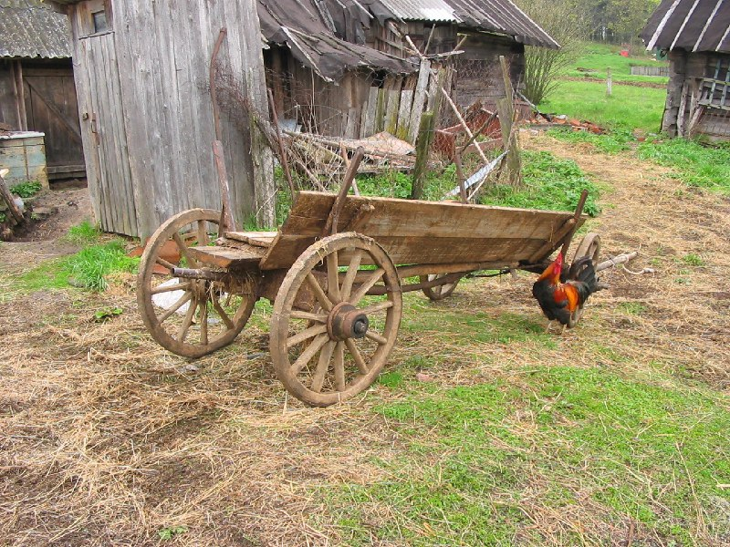

+++
title = ""
date = 2026-02-28T09:10:45+00:00
description = "woodencart village rural belarus globustut year2005 Source,%D0%BD%D0%B0%D0%BF%D1%80%D0%BE%D1%82%D0%B8%D0%B2%D0%BA%D0%BE%D1%81%D1%82%D0%B5%D0%BB%D0%B0,%D1%81%D0%BD%D1%8F%D1%82%D0%BE7%D0%BC%D0%B0%D1%8F2…"

[taxonomies]
days = ["2026-02-28"]
tags = ["wooden_cart", "village", "rural", "belarus", "globustut", "year_2005"]

[extra]
id = 1259
day = "2026-02-28"
tg_url = "https://t.me/vitaly_zdanevich_chan/1259"
og_image = "5264957012829738537_1225843330_460002857.jpg"
next_id = 1260
next_title = ""
prev_id = 1258
prev_title = ""
views = 5
ids = [1259]
+++

{{ tag(t="wooden_cart") }}
{{ tag(t="village") }}
{{ tag(t="rural") }}
{{ tag(t="belarus") }}
{{ tag(t="globustut") }}
{{ tag(t="year_2005") }}

[Source](https://commons.wikimedia.org/wiki/File:052-085_%D0%92%D0%B8%D1%88%D0%BD%D0%B5%D0%B2%D0%BE_(%D0%92%D0%BE%D0%BB%D0%BE%D0%B6_%D1%80-%D0%BD),_%D0%BD%D0%B0%D0%BF%D1%80%D0%BE%D1%82%D0%B8%D0%B2_%D0%BA%D0%BE%D1%81%D1%82%D0%B5%D0%BB%D0%B0,_%D1%81%D0%BD%D1%8F%D1%82%D0%BE_7_%D0%BC%D0%B0%D1%8F_2005.jpg)

