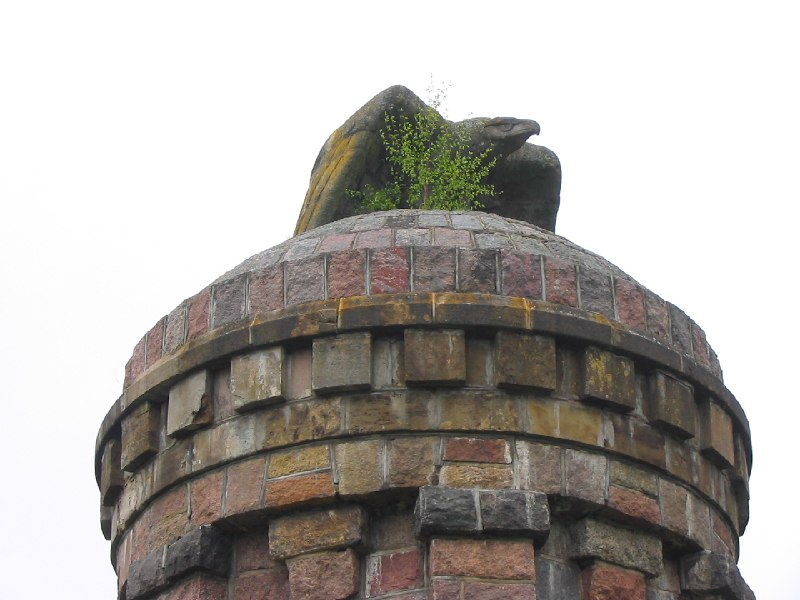
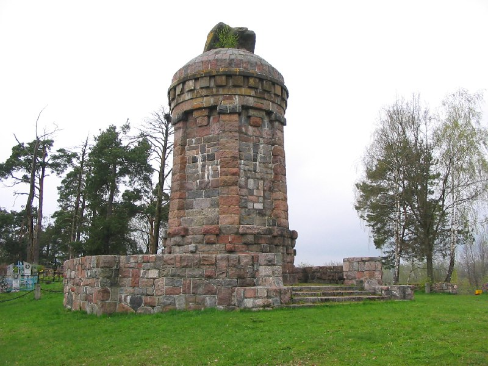

+++
title = "052-093 Десятники, снято 7 мая 2005.jpg"
date = 2026-02-28T09:18:52+00:00
description = "052-093 Десятники, снято 7 мая 2005.jpg monument bird eagle belarus globustut"

[taxonomies]
tags = ["monument", "bird", "eagle", "belarus", "globustut", "year_2005"]

[extra]
tg_url = "https://t.me/vitaly_zdanevich_chan/1260"
og_image = "01.jpg"
next_id = 1262
next_title = "052-115 Голеново, снято 7 мая 2005.jpg"
prev_id = 1259
prev_title = "052-085 Вишнево (Волож р-н), напротив костела, снято 7 мая 2005.jpg"
views = 7
ids = [1260]
+++

[052-093 Десятники, снято 7 мая 2005.jpg](https://commons.wikimedia.org/wiki/File:052-093_%D0%94%D0%B5%D1%81%D1%8F%D1%82%D0%BD%D0%B8%D0%BA%D0%B8,_%D1%81%D0%BD%D1%8F%D1%82%D0%BE_7_%D0%BC%D0%B0%D1%8F_2005.jpg)

{{ tag(t="monument") }}
{{ tag(t="bird") }}
{{ tag(t="eagle") }}
{{ tag(t="belarus") }}
{{ tag(t="globustut") }}

