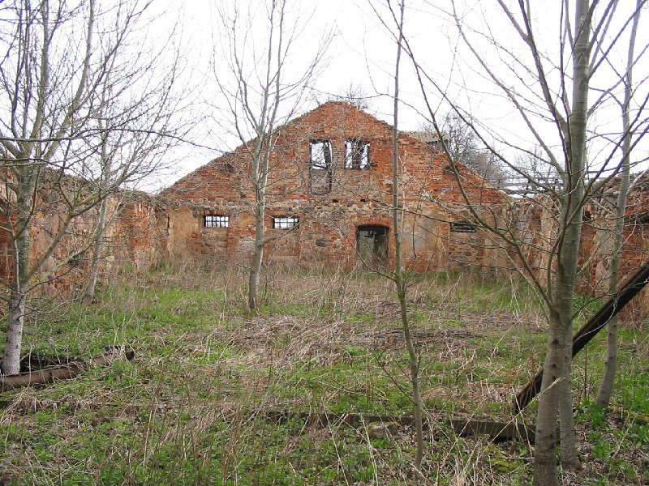
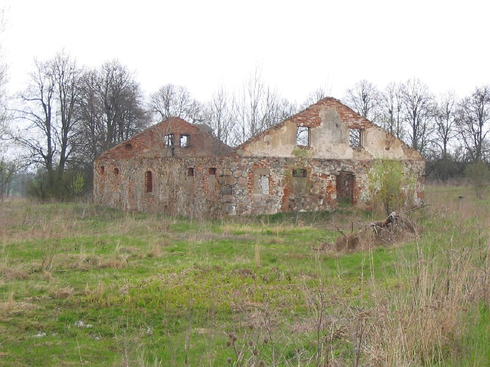

+++
title = ""
date = 2026-02-28T11:07:09+00:00
description = "abandone belarus globustut year2005 Source"

[taxonomies]
days = ["2026-02-28"]
tags = ["abandone", "belarus", "globustut", "year_2005"]

[extra]
id = 1263
day = "2026-02-28"
tg_url = "https://t.me/vitaly_zdanevich_chan/1263"
og_image = "01.jpg"
next_id = 1265
next_title = ""
next_body = "#grave\n#belarus\n#globustut\n#year2005\nSource"
prev_id = 1262
prev_title = ""
prev_body = "#abandon\n#foundation\n#stones\n#belarus\n#globustut\nSource"
views = 10
ids = [1263]
+++

{{ tag(t="abandone") }}  
{{ tag(t="belarus") }}  
{{ tag(t="globustut") }}  
{{ tag(t="year_2005") }}  

[Source](https://commons.wikimedia.org/wiki/File:052-119_%D0%93%D0%BE%D0%BB%D0%B5%D0%BD%D0%BE%D0%B2%D0%BE,_%D1%81%D0%BD%D1%8F%D1%82%D0%BE_7_%D0%BC%D0%B0%D1%8F_2005.jpg)

