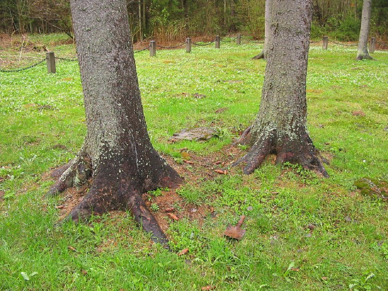
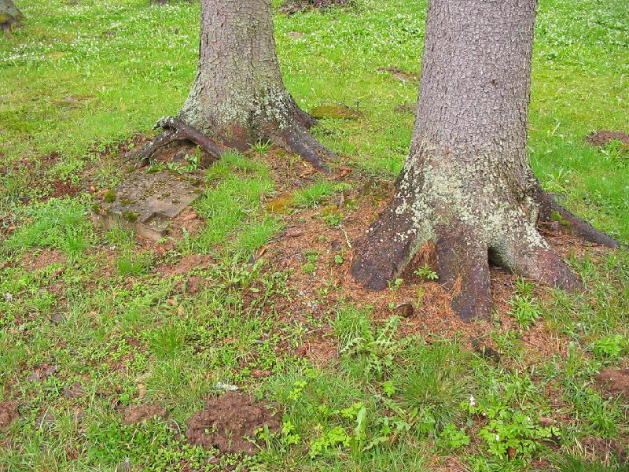
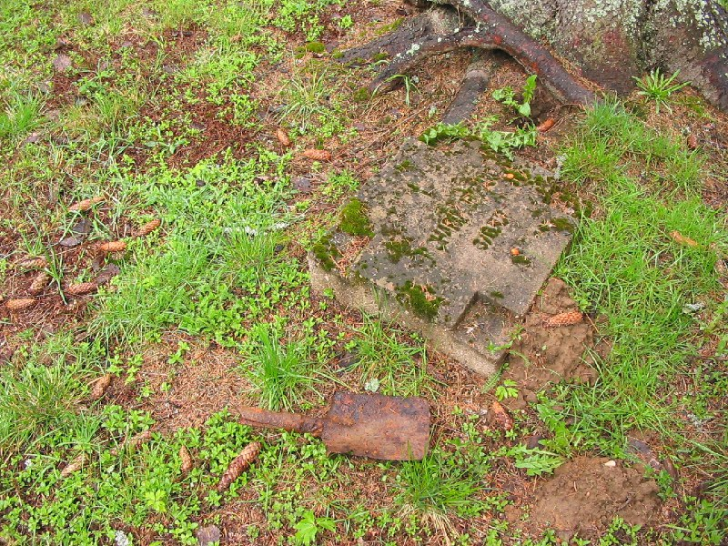

+++
title = ""
date = 2026-03-01T01:30:29+00:00
description = "grave belarus globustut year2005 Source"

[taxonomies]
days = ["2026-03-01"]
tags = ["grave", "belarus", "globustut", "year_2005"]

[extra]
id = 1265
day = "2026-03-01"
tg_url = "https://t.me/vitaly_zdanevich_chan/1265"
og_image = "01.jpg"
next_id = 1268
next_title = ""
prev_id = 1263
prev_title = ""
views = 10
ids = [1265]
+++

{{ tag(t="grave") }}
{{ tag(t="belarus") }}
{{ tag(t="globustut") }}
{{ tag(t="year_2005") }}

Source

