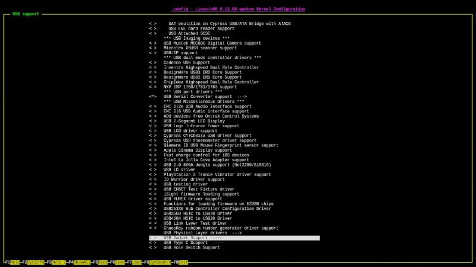

+++
title = ""
date = 2026-03-01T07:24:15+00:00
description = "Wow for the kernel we have not only bright make menuconfig but black make nconfig"

[taxonomies]
days = ["2026-03-01"]
tags = ["kernel"]

[extra]
id = 1268
day = "2026-03-01"
tg_url = "https://t.me/vitaly_zdanevich_chan/1268"
og_image = "5269742426736234904_1226957521_460001688.jpg"
next_id = 1269
next_title = ""
next_body = "#webdesign\n#blue"
prev_id = 1265
prev_title = ""
prev_body = "#grave\n#belarus\n#globustut\n#year2005\nSource"
views = 9
ids = [1268]
+++

Wow for the {{ tag(t="kernel") }} we have not only bright `make menuconfig` but black `make nconfig`

