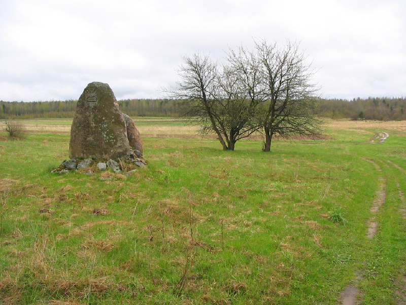
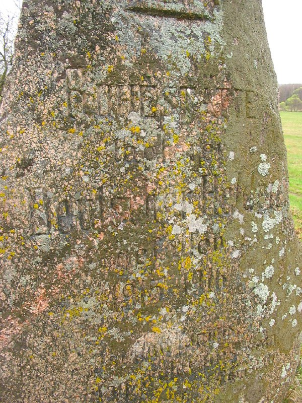
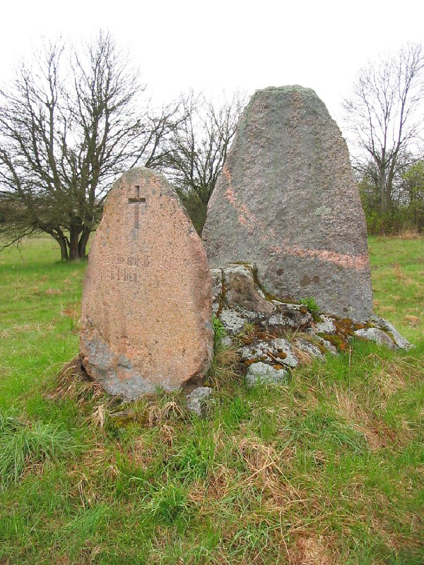
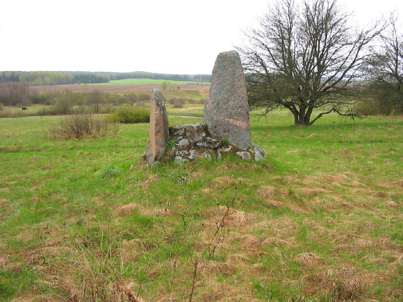
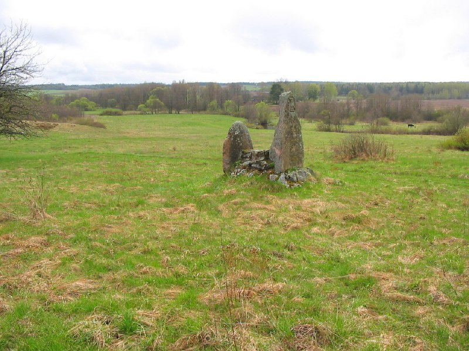
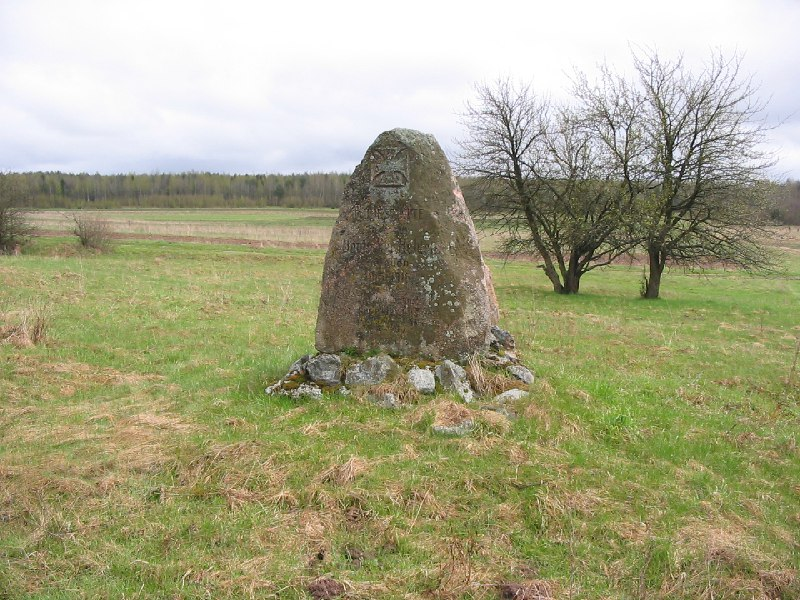
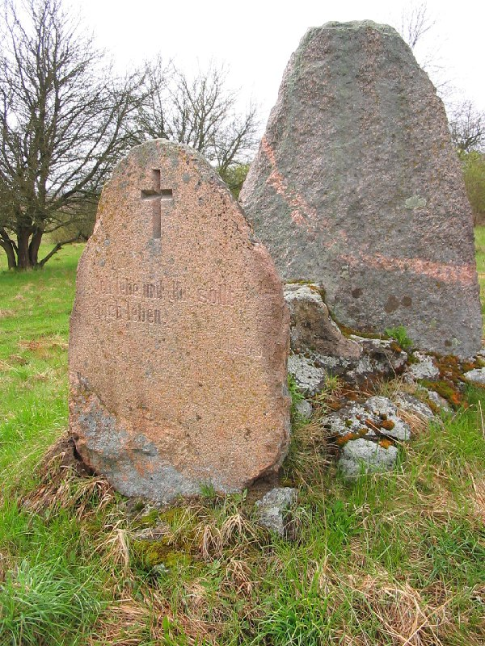
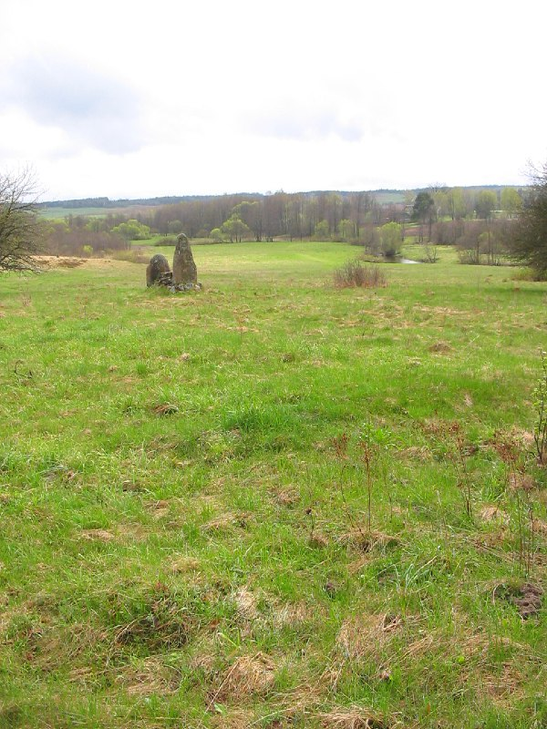

+++
title = ""
date = 2026-03-01T14:06:45+00:00
description = "stones monument belarus globustut year2005 Source"

[taxonomies]
days = ["2026-03-01"]
tags = ["stones", "monument", "belarus", "globustut", "year_2005"]

[extra]
id = 1271
day = "2026-03-01"
tg_url = "https://t.me/vitaly_zdanevich_chan/1271"
og_image = "01.jpg"
next_id = 1280
next_title = ""
prev_id = 1270
prev_title = ""
views = 9
ids = [1271]
+++

{{ tag(t="stones") }}  
{{ tag(t="monument") }}  
{{ tag(t="belarus") }}  
{{ tag(t="globustut") }}  
{{ tag(t="year_2005") }}  

[Source](https://commons.wikimedia.org/wiki/File:052-143_%D0%9A%D1%83%D1%82%D1%8B,_%D0%BD%D0%B5%D0%BC_%D0%BF%D0%B0%D0%BC%D1%8F%D1%82%D0%BD%D0%B8%D0%BA_1-%D0%B9_%D0%BC%D0%B8%D1%80%D0%BE%D0%B2%D0%BE%D0%B9,_%D1%81%D0%BD%D1%8F%D1%82%D0%BE_7_%D0%BC%D0%B0%D1%8F_2005.jpg)

