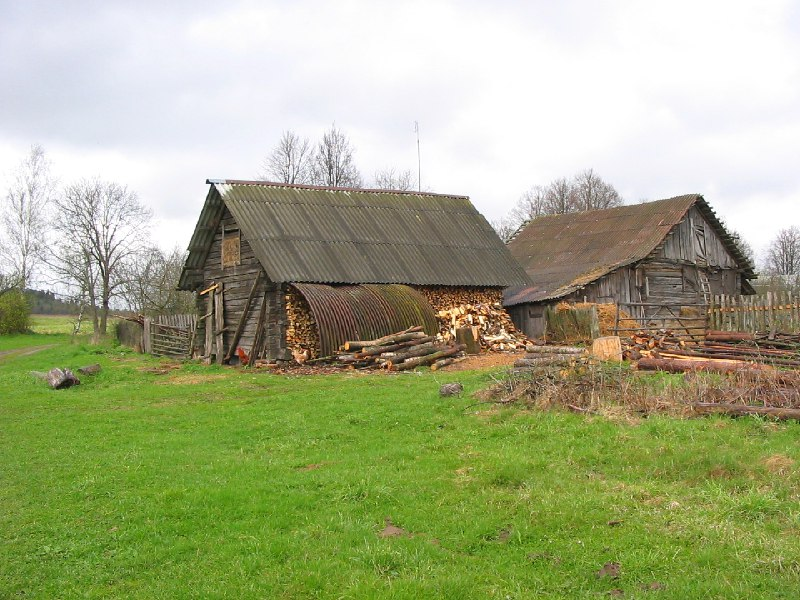
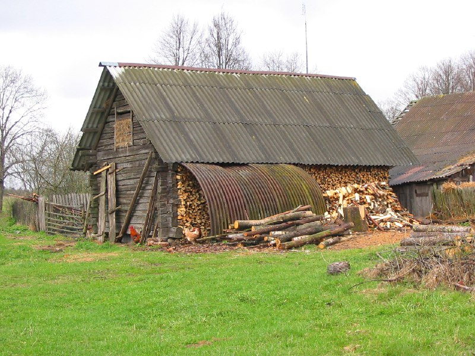
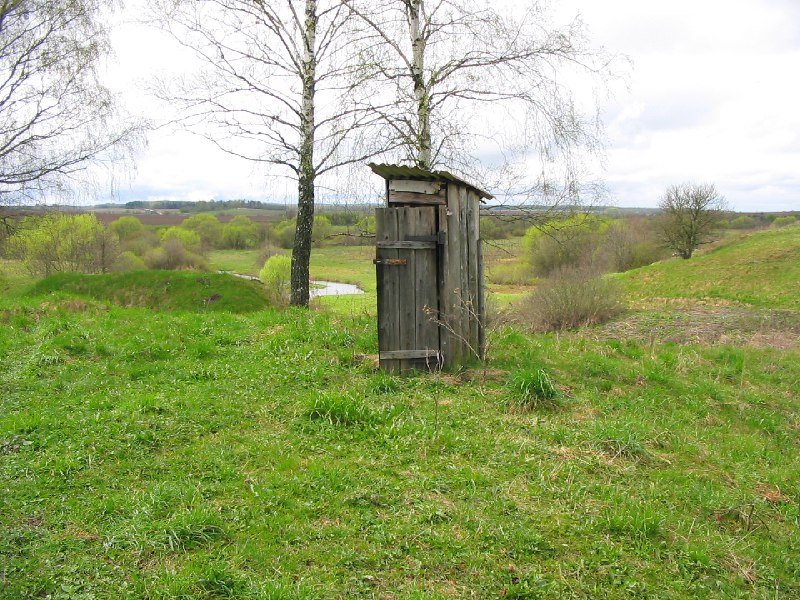
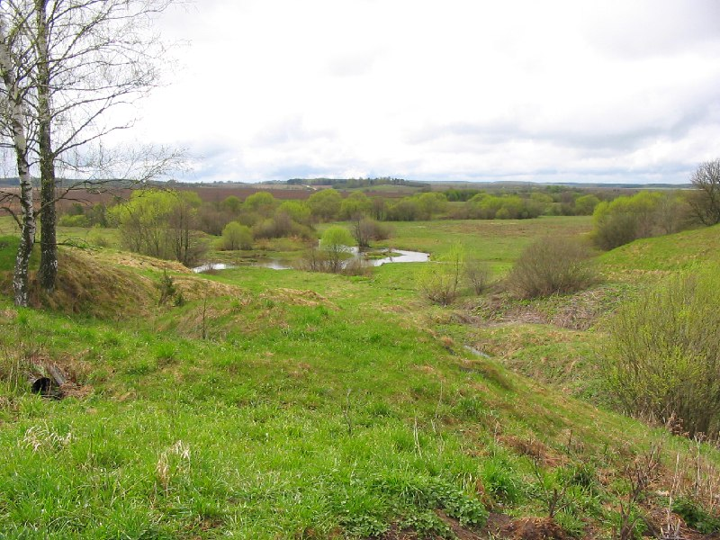

+++
title = ""
date = 2026-03-01T14:14:21+00:00
description = "village belarus globustut year2005Source"

[taxonomies]
days = ["2026-03-01"]
tags = ["village", "belarus", "globustut", "year_2005"]

[extra]
id = 1280
day = "2026-03-01"
tg_url = "https://t.me/vitaly_zdanevich_chan/1280"
og_image = "01.jpg"
next_id = 1284
next_title = ""
prev_id = 1271
prev_title = ""
views = 13
ids = [1280]
+++

{{ tag(t="village") }}
{{ tag(t="belarus") }}
{{ tag(t="globustut") }}
{{ tag(t="year_2005") }}[Source](https://commons.wikimedia.org/wiki/File:052-168_%D0%9A%D1%83%D1%82%D1%8B,_%D1%8D%D0%BB%D0%B5%D0%BC%D0%B5%D0%BD%D1%82%D1%8B_%D0%BE%D1%82_%D0%B4%D0%BE%D1%82%D0%B0,_%D1%81%D0%BD%D1%8F%D1%82%D0%BE_7_%D0%BC%D0%B0%D1%8F_2005.jpg)

