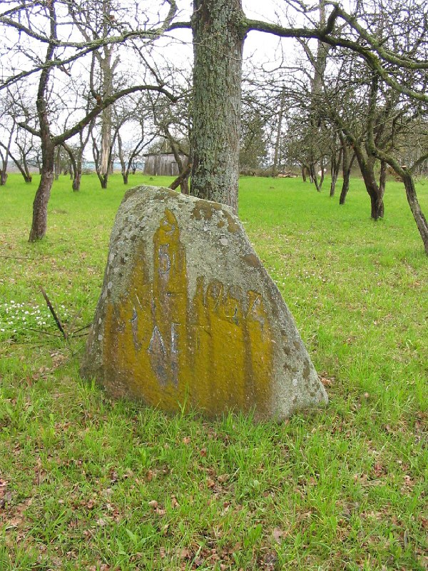

+++
title = ""
date = 2026-03-01T14:15:19+00:00
description = "grave stone belarus globustut year2005Source"

[taxonomies]
days = ["2026-03-01"]
tags = ["grave", "stone", "belarus", "globustut", "year_2005"]

[extra]
id = 1284
day = "2026-03-01"
tg_url = "https://t.me/vitaly_zdanevich_chan/1284"
og_image = "5269742426736235676_1226957521_460002460.jpg"
next_id = 1285
next_title = ""
prev_id = 1280
prev_title = ""
views = 12
ids = [1284]
+++

{{ tag(t="grave") }}
{{ tag(t="stone") }}
{{ tag(t="belarus") }}
{{ tag(t="globustut") }}
{{ tag(t="year_2005") }}[Source](https://commons.wikimedia.org/wiki/File:052-175_%D0%92%D0%B8%D1%88%D0%BD%D0%B5%D0%B2%D0%BA%D0%B0,_%D1%81%D0%BD%D1%8F%D1%82%D0%BE_7_%D0%BC%D0%B0%D1%8F_2005.jpg)

