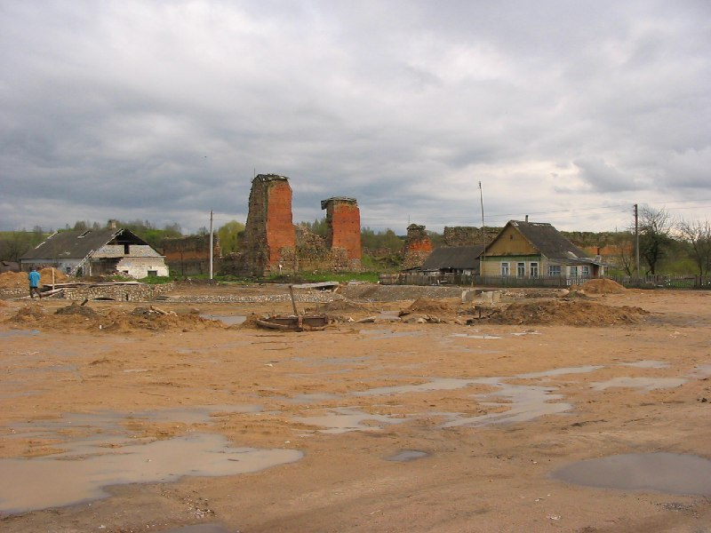
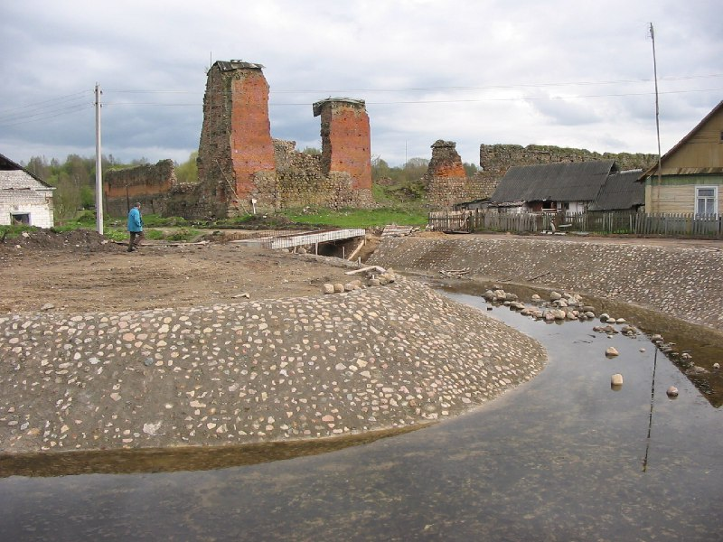
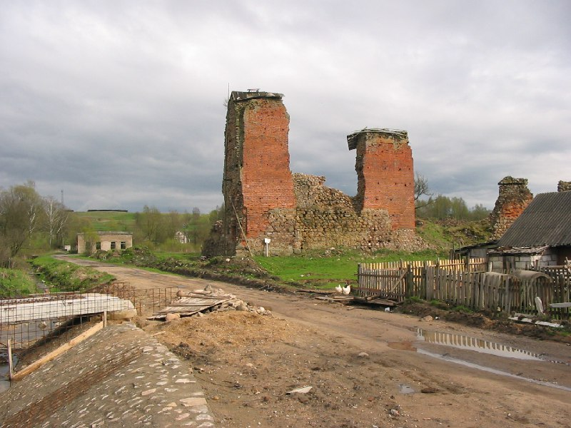
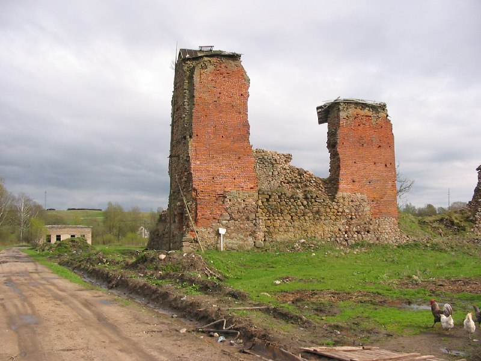

+++
title = ""
date = 2026-03-02T05:13:03+00:00
description = "abandone castle belarus globustut year2005Source"

[taxonomies]
days = ["2026-03-02"]
tags = ["abandone", "castle", "belarus", "globustut", "year_2005"]

[extra]
id = 1294
day = "2026-03-02"
tg_url = "https://t.me/vitaly_zdanevich_chan/1294"
og_image = "01.jpg"
next_id = 1298
next_title = ""
prev_id = 1292
prev_title = ""
views = 16
ids = [1294]
+++

{{ tag(t="abandone") }}
{{ tag(t="castle") }}
{{ tag(t="belarus") }}
{{ tag(t="globustut") }}
{{ tag(t="year_2005") }}[Source](https://commons.wikimedia.org/wiki/File:052-236_%D0%9A%D1%80%D0%B5%D0%B2%D0%BE,_%D0%B7%D0%B0%D0%BC%D0%BE%D0%BA,_%D1%81%D0%BD%D1%8F%D1%82%D0%BE_7_%D0%BC%D0%B0%D1%8F_2005.jpg)

