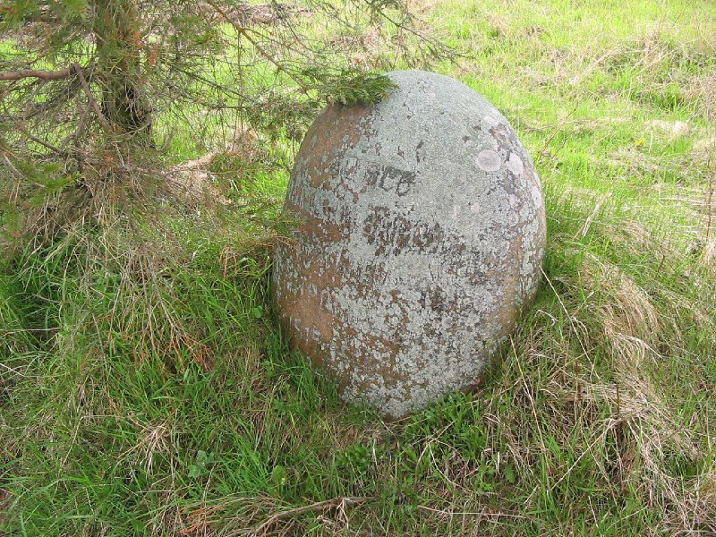

+++
title = ""
date = 2026-03-02T05:15:24+00:00
description = "stone grave belarus globustut year2005 Source"

[taxonomies]
days = ["2026-03-02"]
tags = ["stone", "grave", "belarus", "globustut", "year_2005"]

[extra]
id = 1298
day = "2026-03-02"
tg_url = "https://t.me/vitaly_zdanevich_chan/1298"
og_image = "5271994226549920851_1227481809_460002387.jpg"
next_id = 1299
next_title = ""
next_body = "#bunker\n#fortification\n#military\n#abandone\n#belarus\n#german\n#globustut\n#year2005\nSource"
prev_id = 1294
prev_title = ""
prev_body = "#abandone\n#castle\n#belarus\n#globustut\n#year2005\nSource"
views = 15
ids = [1298]
+++

{{ tag(t="stone") }}  
{{ tag(t="grave") }}  
{{ tag(t="belarus") }}  
{{ tag(t="globustut") }}  
{{ tag(t="year_2005") }}

[Source](https://commons.wikimedia.org/wiki/File:052-255_%D0%9A%D1%80%D0%B5%D0%B2%D0%BE,_%D1%81%D0%BD%D1%8F%D1%82%D0%BE_7_%D0%BC%D0%B0%D1%8F_2005.jpg)

