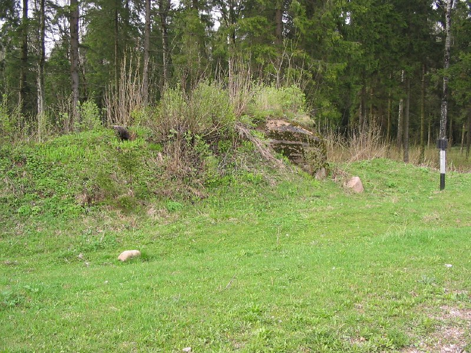
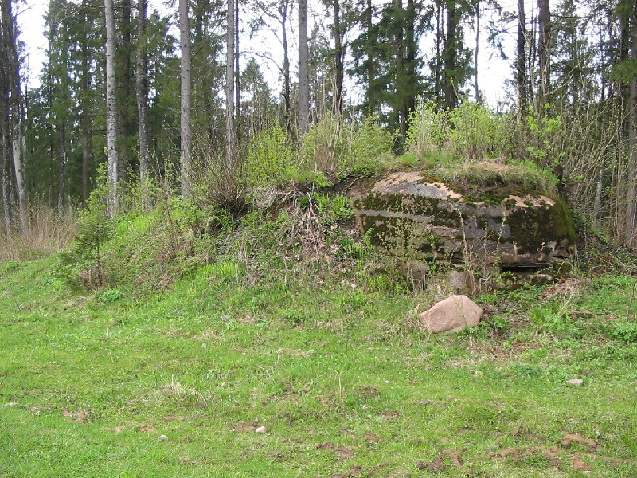
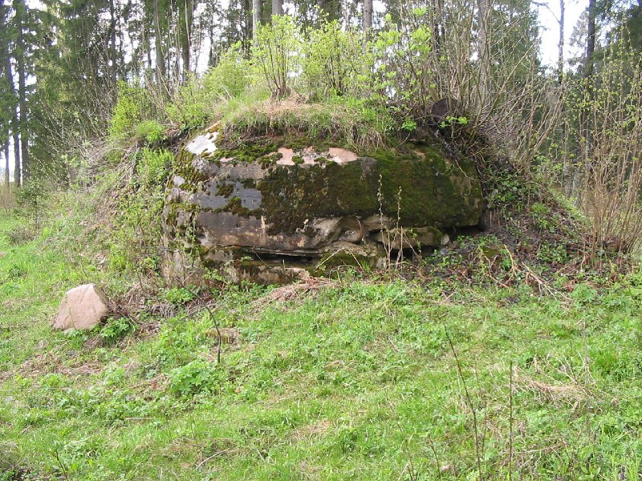
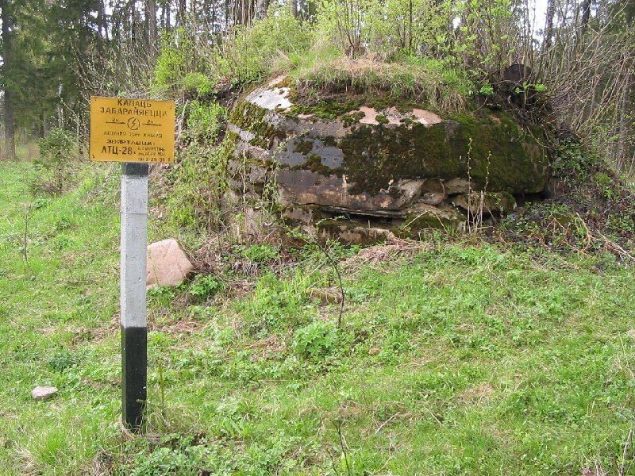
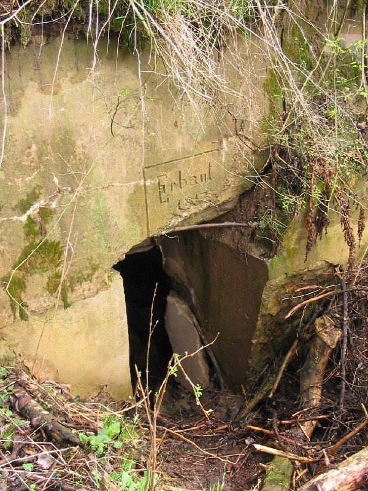
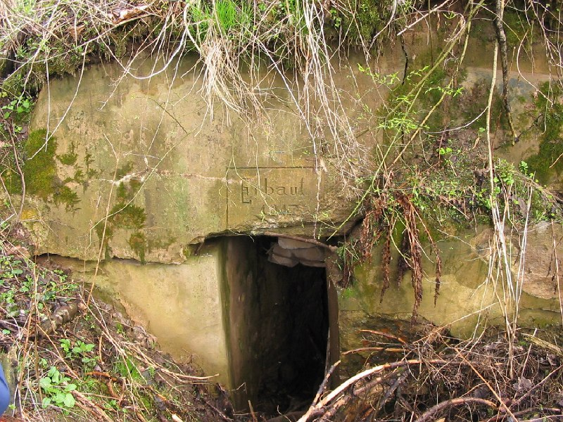
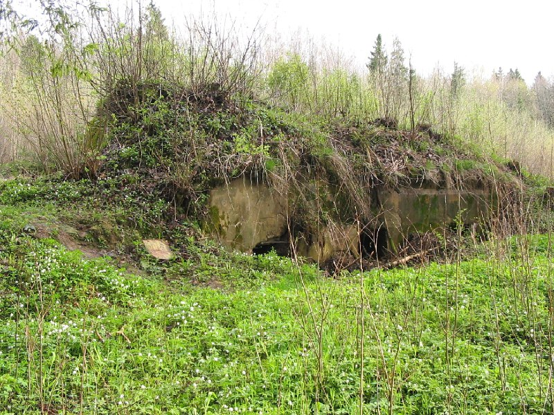

+++
title = "052-263 Богуши, снято 7 мая 2005.jpg"
date = 2026-03-02T05:20:07+00:00
description = "052-263 Богуши, снято 7 мая 2005.jpg bunker fortification military abandone belarus german globustut"

[taxonomies]
tags = ["bunker", "fortification", "military", "abandone", "belarus", "german", "globustut", "year_2005"]

[extra]
tg_url = "https://t.me/vitaly_zdanevich_chan/1299"
og_image = "01.jpg"
next_id = 1306
next_title = "Magic that I can say codex to download all scan - and I get it, for commons"
prev_id = 1298
prev_title = "052-255 Крево, снято 7 мая 2005.jpg"
views = 15
ids = [1299]
+++

[052-263 Богуши, снято 7 мая 2005.jpg](https://commons.wikimedia.org/wiki/File:052-263_%D0%91%D0%BE%D0%B3%D1%83%D1%88%D0%B8,_%D1%81%D0%BD%D1%8F%D1%82%D0%BE_7_%D0%BC%D0%B0%D1%8F_2005.jpg)

{{ tag(t="bunker") }}
{{ tag(t="fortification") }}
{{ tag(t="military") }}
{{ tag(t="abandone") }}
{{ tag(t="belarus") }}
{{ tag(t="german") }}
{{ tag(t="globustut") }}

