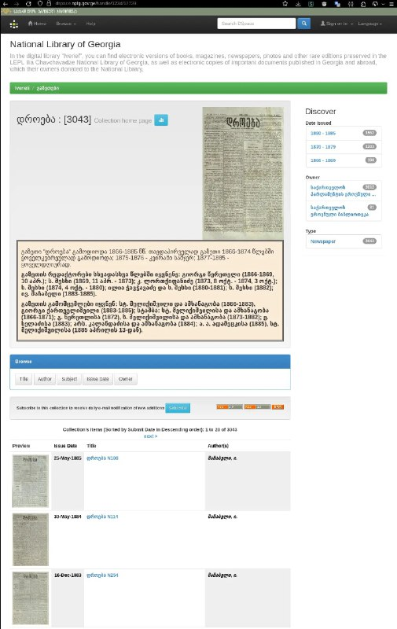

+++
title = "Magic that I can say codex to download all scan - and I get it, for commons"
date = 2026-03-02T05:24:48+00:00
description = "Magic that I can say codex to download all scan - and I get it, for commons"

[taxonomies]
tags = ["codex", "commons"]

[extra]
tg_url = "https://t.me/vitaly_zdanevich_chan/1306"
og_image = "5271994226549920871_1227481809_460002407.jpg"
next_id = 1307
next_title = "2000$ per year to AWS"
prev_id = 1299
prev_title = "052-263 Богуши, снято 7 мая 2005.jpg"
views = 16
ids = [1306]
+++

Magic that I can say {{ tag(t="codex") }} to download all scan - and I get it, for {{ tag(t="commons") }}

<https://dspace.nplg.gov.ge/handle/1234/17729>

