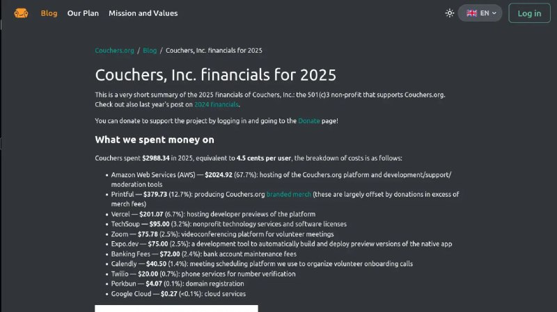

+++
title = "2000$ per year to AWS"
date = 2026-03-02T09:47:59+00:00
description = "couchsurfing money 2000$ per year to AWS"

[taxonomies]
tags = ["couchsurfing", "money", "AWS"]

[extra]
tg_url = "https://t.me/vitaly_zdanevich_chan/1307"
og_image = "5271994226549921339_1227481809_460002875.jpg"
next_id = 1308
next_title = "Wow in kitty we can switch to a prev active tab"
prev_id = 1306
prev_title = "Magic that I can say codex to download all scan - and I get it, for commons"
views = 16
ids = [1307]
+++

{{ tag(t="couchsurfing") }}
{{ tag(t="money") }}

2000$ per year to {{ tag(t="AWS") }}

<https://couchers.org/blog/2026/02/16/couchers-inc-financials-2025>

